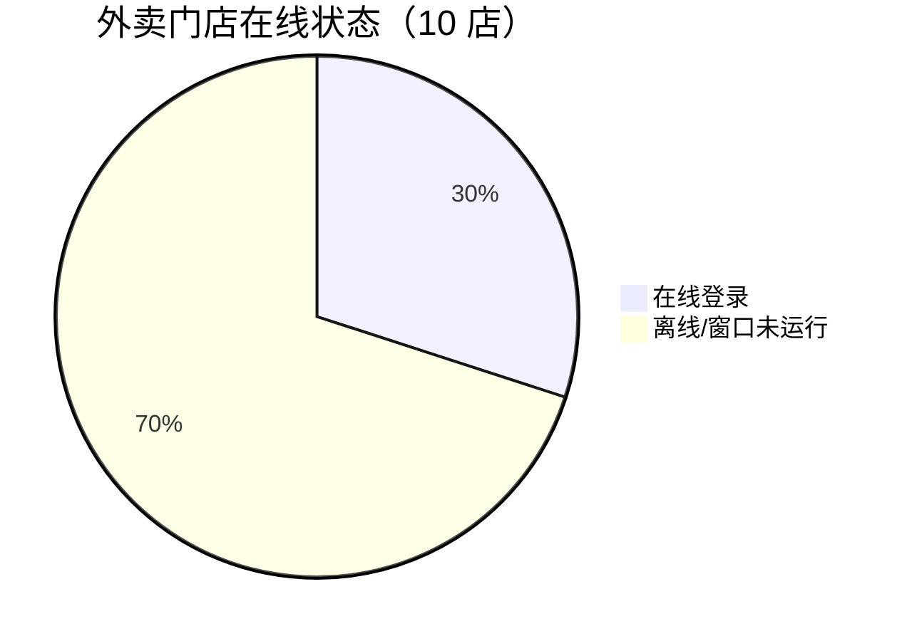

# 生意版图全景 v1（Business Landscape）

> 维护：用户洞察分析智能体（session-2fe61625）· 创建 2026-08-17 · 版本 v1.0
> 数据采集时点：8787 面板 2026-08-17 06:15（基线）/ 06:26 / 06:40 多次读数（在线状态波动，以 waimai_state 实时为准）；Obsidian 摄取文档 2026-08-17
> 定位：五大版图数据摸底 + 8787 只读接入 + 健康度快照（首期任务 #2）
> 数据口径：8787 面板实测（2026-08-17）、Obsidian 摄取文档、协作文档；标注 `[实测]` 的为当日面板数据

---

## 〇、总体快照（2026-08-17）

| 维度 | 值 | 备注 |
|---|---|---|
| 外卖门店 | 10 家（美团 6 / 京东 2 / 抖音 2） | 3 店在线登录，7 店离线 |
| 今日 new_order 事件 | 37 次（全部来自天河3号店；**事件次数≠订单数**，15min 去重窗口口径） | `[实测]` |
| 今日客户消息 | 676 条 | 美团系 6 店采集，京东/抖音 0 条 `[实测]` |
| 待处理告警 | 6 条（含 2 条七夕订单高优告警） | `[实测]` |
| 运营异常 | 1 项（佛山禅城店 Chrome 窗口未运行） | `[实测]` |
| 拒单率（动作口径） | 0%（=拒单/(接单+拒单)；近期无拒单操作，非平台考核口径） | `[实测]` |
| 七夕档事件 | 8/16 单日峰值（天河3号 708 事件）→ 8/17 回落（65） | 节日脉冲特征（事件量同口径对比）`[实测]` |

## 一、版图 1：外卖多店管理（核心，数据最全）

### 门店矩阵（10 店 · 权威 id 映射，非连续：无 1/5/10）
| 门店 | id | 渠道 | 在线 | 今日 new_order 事件 | 今日客户消息 | 高峰时段 | 备注 |
|---|---|---|---|---|---|---|---|
| 天河3号店-初蘅天河 | 2 | 美团 | ✅ | 37 | 165 | 14:00(311)/22:00(193) | 主店，七夕爆量 |
| 天河店2号-体育东 | 3 | 美团 | ✅ | 0 | 23 | 05:00(44) | 在线 |
| 江南西店 | 4 | 美团 | ✅ | 0 | 17 | 14:00(166) | 在线 |
| 客村店/越秀店 | 6 | 美团 | ❌ | 0 | 158 | 22:00(149) | 采集事件有，登录态 off |
| 佛山禅城店 | 7 | 美团 | ❌ | 0 | 158 | 15:00(174) | ⚠️ window_down |
| 天河1号店-守白鲜花 | 8 | 美团 | ❌ | 0 | 155 | 22:00(163) | 今日接单 2 |
| 佛山禅城-京东 | 9 | 京东 | ❌ | 0 | 0 | 22:00(18) | 未采集客户消息 |
| 天河守白-京东 | 11 | 京东 | ❌ | 0 | 0 | 21:00(42) | 未采集客户消息 |
| 天河抖店 | 12 | 抖音 | ❌ | 0 | 0 | 22:00(18) | 未采集客户消息 |
| 天河抖音觅趣守白 | 13 | 抖音 | ❌ | 0 | 0 | 22:00(18) | 未采集客户消息 |

### 关键发现
1. **事件集中在天河3号店**：37 次 new_order 事件全来自此店，其他店为 0——需区分「真无订单」vs「采集未覆盖」（京东/抖音渠道可能因未登录/窗口关闭无事件流）；**事件次数≠订单数**（15min 去重窗口，同单多次快照只计 1 次）`[实测]`
2. **客户消息覆盖不均**：美团 6 店都有采集（17-165 条），京东/抖音 4 店全 0 条——IM 采集通道可能未覆盖或窗口未运行 `[实测]`
3. **时段热力**：14:00 与 22:00 双高峰明显；深夜 01:00-05:00 有持续状态变化（备货/履约活动）`[实测]`
4. **七夕档复盘价值**：8/16 事件量（708/店）远超 8/17（65/店）≈ 10.9 倍，节日脉冲是核心营收引擎，与 BP「节日期货套利」一致 `[实测]`

### 接入方案（只读，免锁并行）
- ✅ 已接入：`/api/state`（10 店状态）、`/api/alerts`、`/api/issues`、`/api/report`（日报聚合）、waimai_report/waimai_analyze
- ✅ 权威店 id 映射（45f89009 提供，非连续：无 1/5/10）：2=天河3号 / 3=体育东 / 4=江南西 / 6=客村 / 7=佛山禅城 / 8=守白 / 9=佛山禅城-京东 / 11=天河守白-京东 / 12=抖店 / 13=抖音觅趣守白
- ⚠️ 此前 `/api/business?store=N`「店铺不存在」根因 = 用连续 1-10 取数；按上表 id 调用即可
- ⏳ 待验证：`/api/business`、`/api/review`、`/api/traffic`（按权威 id；traffic 曾超时，疑为窗口未开/登录态）

## 二、版图 2：活动公司（数据摸底进行中）

- 已知品牌：**觅趣**（品牌策划公司，业务简介 2025 PPT）、**桦桓艺**（索菲亚项目执行）、中芬国际文化交流中心活动策划
- 已知项目：索菲亚全球发展中心开业庆典/乔迁典礼（结案 PPT 2025-01）、2024 觅趣活动案例
- 业务类型：签约仪式/开业庆典/活动策划/主持人资源（主持人手卡生成器 AI 原型佐证）
- 数据源：`~/Dropbox/CH共享文件夹`、Desktop 历史索引（01_银行活动公司，目录当前不在桌面——疑已迁移，待定位）
- 健康度：**未接入实时数据**，需用户提供当前项目线/营收量级后建立指标

## 三、版图 3：鲜花供应链（模式清晰，数据待补）

- 四级采购：云南（空运/陆运）→ 广州岭南 → 天河临采，逐级降本 `[BP文档]`
- 囤货逻辑：节前低价囤货 + 分阶梯涨价（溢价最高 300%）`[BP文档]`
- 标准化体系：花材标准化文件（玫瑰/百合/康乃馨/绣球/向日葵等 8+ 主花材的到货/理花/养护 SOP）、6S 现场管理、物品命名规范、调拨 SOP `[Obsidian]`
- 冷库：BP 目标 2026-02 前建成 1 中央冷藏库——**建成状态待确认**
- 健康度：无采购成本/损耗率/库存周转实时数据，需与供应链专员 0e84e65c 协作摸底

## 四、版图 4：财务管理（摸底缺口最大）

- 已知：Desktop 银行/财务分类（历史扫描 71K 文件）、【趣趣就来】业务管理表（xlsx 导出 1.64GB）
- 缺口：无记账系统信息、无现金流/毛利/净利指标、无成本结构数据
- 建议：与用户确认是否使用记账软件/表格；确认后建立财务健康指标（现金流/毛利率/回款周期）

## 五、版图 5：AI 创业探索（原型多，商业化待定）

- 已知原型（Downloads docx）：花觅小程序、活动主持人手卡生成器、活动拍摄分镜工具、绿植销售签收生成器、AI 工具学习平台、测试审查
- 已知工作区：Desktop 05_AI自动化 workspace-gm（OpenClaw 备份、flower-images 数据集 329MB）
- 判定：处于「一人可用 AI 创业」探索期，多个原型未验证商业化；本版图与「AI 变现思路」（增长层职责）直接相关

## 六、健康度快照（8/17 基线）

| 健康项 | 状态 | 说明 |
|---|---|---|
| 面板服务 | ✅ 正常 | 8787 API 全通（state/alerts/issues/report） |
| 主店采集 | ✅ 正常 | 天河3号店事件/IM 活跃 |
| 登录覆盖 | 🟡 3/10 | 7 店离线：4 店 window_down（含佛山禅城）、3 店 running:false |
| 告警处理 | 🟡 6 待处理 | 2 条七夕高优 + 4 条积压 |
| 拒单率（动作口径） | ✅ 0% | 近 7 日无拒单操作（=拒单/(接单+拒单)，非平台考核口径） |
| 京东/抖音采集 | ❌ 4 店 0 消息 | IM 采集通道疑未覆盖/窗口未开 |

## 七、机会点初筛（供后续降本/增长路线图）

1. **补单激励已规划**：raw 文档「外卖鲜花门店补单量激励规划」——可量化激励 ROI
2. **催单场景自动化**：近 2h 催单/配送场景 79 次（天河1/3号、客村）——客服自动催单回复可降人力 `[实测]`
3. **离线店自动重连**：window_down 自动拉起（运维侧 6e49710e 已有健康脚本基础）
4. **告警自动分流**：6 条待处理告警按 kind 自动归类/通知对应角色
5. **京东/抖音渠道补采集**：打通 4 店客户消息通道 = 新增 4 个数据源
6. **节日日历化运营**：把 10+ 节日套利节点做成运营日历（备货/上架/涨价/复盘四段式）

---

## 变更日志
- **v1.0（2026-08-17）**：创建。五大版图摸底 + 8787 接入验证 + 健康度基线。
