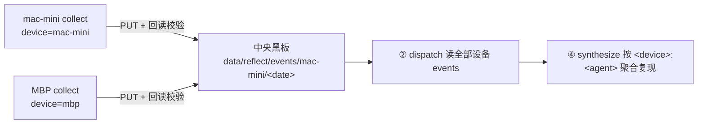

# reflect-collect · 当日事件采集 + 跨设备上传（R006 十项达标 · v1.1.0）

> 星桥/明鉴 v3 · 2026-09-10/11 · R006 ①②③④⑤⑥⑦⑧⑨⑩ 全达标 · 位置 `~/dsh-collab/devices/dsh-plugin-reflect-collect/`
> 设计依据：`docs/daily-reflection-pipeline-design-v1.md`（① 采集 环节 + §10 跨设备层）

**一句话**：采集「当日发生的事件」→ 结构化事件流 → 落本地 `data/reflect/` + PUT 中央黑板 `data/reflect/events/<device>/<date>`（**写入后必回读校验**），供「每日反思」流水线做跨设备的集体反思。

---

## ① 为什么需要它（事故与证据，全部实测）

| 证据（可复现） | 没有它时的实际情况 |
|---|---|
| 2026-09-10 当日 `~/dsh-collab` 内变动文件 **756 个**（已排除 `.git`/`node_modules` 等；含 `.git` 为 6053 个）、黑板当日新卡 **819 张**（`GET /data/` 20140 键中按 ts 过滤） | 人工"回想今天干了什么"必然漏；每个会话各自去找 → **每个会话重复找**（R006 §1 的规律） |
| 本机当日 5 个源合计 **1692 条**事件（files 756 / board 819 / tools 85 / logs 32 / git 0） | 数量级决定了这只能是机器产物，不能是人工清单 |
| **本日已知纪律事故：4 次"报告指向不存在的落盘物"**（写入返回非 200 被当成成功） | "我 PUT 了"≠"它在那儿"。本工具把**回读校验**做成结构的一部分（PUT 200 + GET 同 key + 规范化内容一致），而不是靠人记得检查 |
| 设计文档 §10.1：MBP 上跑着**独立 DSH 会话**（独立智能体网络） | **只采本机 = 只看到四分之一**；跨设备事件若不汇聚，MBP 的经验是永久盲区 |
| 本日实测：凭据形态扫描器初版在**真实事件流**上产生 12 处误判（`flowernet-tech-path-moat-revision-v1.md`、UUID `664ce0d2-2ef1-4a68-b1d4-b86209009911`、`laodeng-app-arch-v1_0-20260903-100236.svg`、`cloudbase-plan-push-task` …） | 一个"为了安全"的扫描器若不过精度关，**会先把事件流毁掉**（把 756 条文件名变成 `[REDACTED]`）。故本工具的能量全在"该抓的抓、该留的留" |

## ② 用法（含退出码）

```bash
# 采集今天（默认窗口 00:00:00–23:59:59）+ 落本地 + 上传中央 + 回读校验
node ~/dsh-collab/devices/dsh-plugin-reflect-collect/cli.js

# 人类可读摘要 / 机器可读
node cli.js --summary
node cli.js --json > /tmp/events.json

# 指定窗口与源（每个源独立开关）
node cli.js --since 2026-09-10 --until 2026-09-10T23:59:59
node cli.js --sources files,logs      # 或 --no-board --no-git
node cli.js --limit 50                # 每源最多 50 条

# 零变更（不写产出、不写日志、不上传）—— 交付前必跑
node cli.js --dry-run --summary

# 跨设备
node cli.js --device mac-mini         # 默认：主机名别名表命中（本机 → mac-mini）
node cli.js --no-upload               # 中央不可达时只落本地
node cli.js --allow-secrets           # ★危险：跳过凭据脱敏（仅调试）

# 自检与门自证（R006 §5 验收三步）
node cli.js --selfcheck               # ② TCC 三段
node cli.js --lean4-check             # ⑩ A–F 六项
node cli.js --tool-version            # ⑥ 与 package.json 一致
```

**退出码**：`0` 成功/门生效 · `1` 有源采集失败 **或** 上传/回读校验失败 · `2` 用法错误或 IO 错误（含被参数门拒绝的值，如 `--out /etc/passwd`、`--sources hack`、`--board-url <远端>`）。

**产出**
| 位置 | 内容 |
|---|---|
| `~/dsh-collab/data/reflect/events-<YYYYMMDD>.json` | 事件流（`window/device/hostname/collected_at/counts/events/errors/secrets_redacted`） |
| `~/dsh-collab/logs/dsh-plugin-reflect-collect.log` | ⑦ 统一日志（每动作一行 JSON：时间/输入/判断/结果/诊断，**失败也留痕**） |
| 中央黑板 `data/reflect/events/<device>/<date>` | 跨设备汇聚点（PUT + 回读校验） |

## ③ R006 十项达标矩阵

| # | 项 | 达标 | 实现与证据 |
|---|---|---|---|
| ① | dsh 插件形态 | ✅ | `package.json`（type:module / main / version / `dsh.bundle.patch`）+ `cordis.patch.yml`（`- insert: [{id,name,config}]`）+ `lib/index.js` 导出 `apply(ctx,config)`、`export const inject=['tools']`、注册 `reflect_collect`。**实测**：`node --input-type=module -e "import('./lib/index.js')"` 无报错；用 mock ctx 跑 `apply()` → 工具注册成功、`sources.items.enum` 冻结、入参中无 `outPath/method/url/command/token`、`execute()` 真跑通。无 `dsh.client`（本插件无客户端能力，故不声明） |
| ② | TCC 检测 | ✅ | `--selfcheck` **五段**：①能力清单 ②**不该发生路径清单（12 条）** ③依赖完整性（peer 两级解析 + 版本范围判定 / node 环境问题 vs 包问题分开标 / 中央与本机黑板可达性）④**真挂载冒烟**（import `lib/index.js` + 桩 ctx 调 `apply()` → 数注册了几个工具、校验工具形状与 `inject`；**peer 解析不到时如实标「跳过」而非「通过」**）⑤自证摘要（结构门/凭据/白名单计数）。结果并入 `.selfcheck/reflect-collect.json` |
| ③ | CLD 自适应 | ✅ | 运行期只用 node 内置模块 + 系统 `git`；无宿主时 CLI 独立可跑（**实测踩坑后修的**：v1.0.0 初版 CLI 从 `lib/index.js` 取版本号 → 无宿主直接 `ERR_MODULE_NOT_FOUND`；现版本读取下沉到零依赖 `lib/version.js`） |
| ④ | dsh 版本自适应 | ✅ | `peerDependencies` 正式声明 **且被机械判定**：`@deepseek-ai/cordis >=4.0.0 <5.0.0`（实测 4.0.2 ∈ 范围）、`@deepseek-ai/dsh-tools >=0.1.1-rc.1 <1.0.0-0`（实测 0.1.1-rc.2 ∈ 范围）。判定器是包内零依赖的最小 semver（`lib/gate.js peerSatisfies`，只覆盖本包声明的 5 种形态，不支持的形态**明确报 unsupported 而不是假装通过**）；`--selfcheck` 打印每个 peer 的**被解析到的版本 + 声明 + 判定结果**；两级解析（本目录 → `~/.dsh/profiles/node_modules`）；不 import 任何宿主内部路径。**★ 这一项初版是真的没做到位**：见坑 12 |
| ⑤ | 文档化 | ✅ | 本文件（五要素齐）+ 源码 docstring 含错误模型复盘；路径写入 `package.json` 的 `r006.documented` |
| ⑥ | 版本管理 | ✅ | 版本**只**写在 `package.json`（1.1.0）；`--tool-version` 从包读并当场比对一致性；`CHANGELOG.md` 含 5 条纠错复盘 |
| ⑦ | 统一日志 | ✅ | `~/dsh-collab/logs/dsh-plugin-reflect-collect.log`；每动作一行 JSON（时间/输入/判断/结果/诊断）；**失败也留痕**（源失败、上传失败、上传异常都在 diagnosis 里） |
| ⑧ | 自动落链 | ✅ | ① **不新增规则号**：本工具不定义规则（明确说明，`RULES.md` 未改）② 黑板登记卡 `data/registry/dsh-plugin-reflect-collect`（**由人在工具之外落链**：工具本身只写 `reflect` 命名空间，没有写 registry 的能力）③ 产出写 `data/reflect/` |
| ⑨ | CLI 治理 | ✅ | 严格参数解析（未知旗标 exit 2）；退出码 0/1/2 语义固定；`--dry-run` **零字节落盘（含不上传、不写日志）**；`--json`；`--help` 自解释 |
| ⑩ | 约束前置·不可绕过 | ✅ | 见下节（结构门 + `--lean4-check` A–F 六项） |

## ③b 真挂载冒烟（② 的第 ④ 段）——为什么"跳过"比"通过"更诚实

兄弟插件靠这一项抓到过 **apply 阶段直接抛 `UNSUPPORTED_SCHEMA`**（output schema 漏 `additionalProperties` → 宿主启动即崩）的真缺陷；本包在开发期也被它抓到过同类问题（见坑 9）。

实现（`lib/selfcheck.js mountSmoke`）：`import lib/index.js` → 构造**桩 ctx**（`tools.register` 收集注册项、`effect` 立即执行并捕获异常）→ 调 `apply(ctx, {})` → 断言「注册数 ≥1 + 工具形状齐备（name/description/parameters/execute）+ `inject` 含 `'tools'`」。

**六条分支全部实测过**（不是只测成功路径）：

| 分支 | 实测结果 |
|---|---|
| 真实挂载本包 | `passed` · registered=1 · `reflect_collect` · effect 执行 1 次 · 0 异常 |
| **peer 解析不到** | `skipped` + 原因原文（`@deepseek-ai/does-not-exist-peer(Cannot find module …)`）→ **不判通过**；退出码不受影响（环境问题 ≠ 包问题） |
| 导入期失败 | `failed @import` |
| 缺 `apply` 导出 | `failed @shape`（"未导出 apply(ctx, config)（R006 ① 要求）"） |
| **apply 阶段抛错** | `failed @apply` + 异常名/消息/`code=UNSUPPORTED_SCHEMA` 原样透出 |
| apply 不抛错但**注册 0 个工具** | `failed @assert`「注册工具数 = 0」（**不被 try/catch 吞掉**） |

防递归：模块级 `inSmoke` 闸门挡住「冒烟 → apply → runSelfCheck → 冒烟」。默认**不**在宿主内自动跑（`lib/index.js` 的 apply 里不启用），只有 `--selfcheck` 显式启用 —— 因为宿主调 apply 那一刻本身就是真挂载。

## ④ ⑩ 结构门：**不该发生的路径**与为什么它"不可绕过"

本工具的"不该发生路径"有 6 条，每条都由**结构**（不是纪律）封堵：

| 不该发生 | 封堵方式（门型） | 证明 |
|---|---|---|
| 采集动作写出/改动**被采集对象** | **能力缺失**：除唯一写入模块 `lib/log.js`（3 个 `guarded*` 封装点，入口第一行 `assertWriteAllowed`）外，**全包零本地写入/删除原语** | A 项：去注释/字符串/正则后扫描 `writeFileSync/mkdirSync/rmSync/unlinkSync/renameSync/createWriteStream/openSync…` **命中 0** |
| 写到本地白名单外（`docs/`、`scripts/`、`registry/`、`/etc`、`..` 穿越、软链逃逸） | **入口门 + 类型锁**：`WRITE_TARGETS` 冻结 3 条（日志文件 / `data/reflect/` / 自己的包目录），`--out` 不在其中即 exit 2；判定用 `resolve + realpath` 双条件 | B 项 15 条负例全拒；C 项 3 条正例全过 |
| 写**本机**黑板（把本机事件回流成"外部事件"） | **无表达**：本机读只 `GET /data/ /notes/`；写只允许中央 + 一个 key 形态 | B 项 `PUT 本地黑板`、`PUT 本地 registry` 均被拒 |
| 上传到**别的 key**（`registry`/`cards`/`answers`）或**别的实例** | **Schema 门（路径正则）+ 冻结 origin**：`assertBoardUpload` 三条件同时成立（PUT + `106.53.214.108` + `^/data/reflect/events/<device>/<date>$`），且 `httpPutJson` 只能被 `lib/upload.js` 调用 | B 项 13 条上传负例全拒；F 项证明 `httpPutJson` 调用点 ∈ `[lib/upload.js]`、`http.request` ∈ `[lib/transport.js]` |
| **未脱敏**凭据跨设备扩散（Φ12 形态④） | **fail-safe 默认**：落盘与上传前跑 6 类凭据形态扫描，命中即 `[REDACTED]` 并计数 `secrets_redacted`；`--allow-secrets` 是显式人工开关 | B 项凭据矩阵：**必须脱敏 11/11**、**必须保留 10/10**（后者全取自真实事件流的合法形态） |
| **只信 200 不回读** / 事件缺时点（Φ13） | **状态机 + 断言**：`uploadEvents` 必须 PUT→GET→比对（规范化 JSON sha256 + key 一致性），任一不成立即 `ok:false`→exit 1；`stampEvents` 唯一打点 + `assertEventStamped` 逐条门检 `ts/collected_at/origin_device` | B 项 readback 6 条负例（PUT 非 200 / 回读 404 / 内容不一致 / 缺 sha / key 错位）全判失败；event-stamp 7 条负例全拒 |

**`--lean4-check` 六项**（模板 §4.2）：A 源码无危险原语 · B 负例全部被拒 · C 正例可用 · D `--dry-run` 零变更（实测）· E 白名单冻结 · F 写入点/命令/网络/上传点白名单（均要求枚举数 > 0，**防"空集通过"**）。

## ④b 跨设备字段契约（上游协议：harvest 与 dispatch 依赖它）

harvest / dispatch 明确依赖下面这些字段与路径；本包**逐条实测确认**（用 curl 直接读中央黑板，不经本工具代码）：

| 依赖方 | 契约 | 实测证据（2026-09-11） |
|---|---|---|
| harvest | 每条事件：`ts`（对象时刻，**设备本地时间带显式偏移**）+ `collected_at`（**采集时刻 UTC**，Φ13 双时点分开标）+ `origin_device`（**采集者**，不是"文件在哪"） | `data/reflect/events/mac-mini/2026-09-10`：**1692 条中缺 `ts`=0、缺 `collected_at`=0、缺 `origin_device`=0**；抽样 `ts=2026-09-10T00:00:13` / `collected_at=2026-09-10T16:35:52.531Z` / `origin_device=mac-mini` |
| harvest | 顶层 `device` + `hostname` + `plugin_version`（跨设备版本漂移排查） | 顶层字段实测包含 `device=mac-mini`、`hostname=CoreydeMac-mini.local`、`plugin_version`（最新上传为 **1.1.1**） |
| dispatch | 上传路径 `data/reflect/events/<device>/<date>`，首段纯小写字母 | 本机 device → `mac-mini`（主机名别名表），key 由 `buildUploadKey()` 唯一构造并过 `assertBoardKeySyntax`；中央两个 key HTTP 200 |

**心跳（dispatch 建议 ③）实测**：`data/discovery/agents/mac-mini` 在**中央**实例存在（HTTP 200，`version=11634`，`ts` 距测时 **2 秒**，字段 `device/heartbeat_ref/schema/sessions/status/ts/via`，`sessions` 列出各会话角色）；在**本机**实例是 **404**。⇒ 在场判定应查**中央**，别查本机。本工具**不写**该心跳（写它是发现层的职责；本工具的可写位置仍是冻结的 1 个上传 key 形态 + 本地白名单 3 条）。

## ⑤ 跨设备层（design v1.1 §10）



- **设备名**：默认取 `os.hostname()` 的短名过**冻结别名表**（本机 `CoreydeMac-mini.local` → `mac-mini`）。**为什么必须做别名**：兄弟环节已经在用 `data/reflect/{cards,answers}/mac-mini/`（实测目录存在），若用裸主机名 `coreydemac-mini`，key 段就对不上、跨设备链会断在命名上。
- **key 语法**：首段必须纯小写字母（`data` ✅），后续段自由 → `data/reflect/events/mac-mini/2026-09-10` ✅ 合法。设备名本身也过门（`[a-z0-9][a-z0-9-]{0,31}`），因为它要进 key 段。
- **回读校验**：PUT 200 + GET 同 key 200 + **规范化 JSON**（键排序、无空白）sha256 一致 + 卡片 `key` 一致。任一不成立 → `ok:false`、日志 `result: fail`、exit 1。
- **凭据扫描**：6 类形态（`grouped-triplet` / `provider-id-FL` / `assignment` / `bearer` / `pem-private-key` / `known-prefix`），本地落盘与上传**共用同一份 payload**，所以不存在"本地脱敏了、上传没脱敏"的路径。
- **时点三件套**（Φ13）：每条事件 `ts`（**设备本地时间 + 显式时区偏移**，如 `2026-09-10T23:49:13+08:00`）、`collected_at`（**采集时刻 UTC**，如 `2026-09-10T16:35:37.128Z`）、`origin_device`（**采集者**，不是"文件在哪"——同步盘会让同一文件在两台设备都可见）。顶层另有 `device` / `hostname` / `plugin_version`（跨设备版本漂移排查用）。
- **对端实测**：中央黑板 `data/reflect/events/mbp/2026-09-10` 已存在（另一台设备上传），其字段形态与本工具一致（`device/hostname/collected_at/counts/events`、事件带 `ts/collected_at/origin_device`）；本机上传的 `mac-mini/2026-09-10`（1692 条）与 `mac-mini/2026-09-11`（291 条）已回读校验通过。

## ⑥ 与 R003 补充通告 v2 的一致性（2026-09-11 采纳，附独立复测）

本工具读了 `data/registry/r003-key-syntax-notice-20260911` 后**先独立复测再采纳**（R030 无验证不陈述）。复测结果与通告有一致、也有修正：

| 通告条目 | 我的独立复测 | 本工具怎么落地 |
|---|---|---|
| rule_1 首段 `[a-z]+`；后续段 `[A-Za-z0-9._-]`；空段必须拒 | **一致**：`Registry/x`、`Data/reflect`、`data/reflect/a%20b`、`a:b`、`a+b`、`a@b`、`a~b`、`a!b`、`..%2F` → 全部 **400**；`data/reflect/a.b-c_d` → **404**（格式合法） | `assertBoardKeySyntax()` 在**构造 key 时**校验（首段/后续段/空段三段判据），并被 `buildUploadKey()` 与 `assertBoardUpload()` 同时调用 —— 非法 key **结构上构造不出来**。新增 16 条负例 + 4 条正例 |
| rule_2 `400`=键错 / `404`=不存在，不可合并为布尔 | **一致** | `centralKeyState()` 返回**四态** `present` / `absent(404)` / `bad-key(400)` / `unreachable`，`--selfcheck` 逐态标注；`bad-key` 出现即视为**门漏了**（因为客户端本该拦住） |
| rule_3 回读须到"内容与预期语义相等"；必须规范化键序，否则假失败 | **一致，且我踩过同一个坑**：初版用"原文 sha256"比对，黑板把上传体存为信封 `{key,ts,value,version}` 并重序列化 → 原文 `82445f…` vs 回读 `c3087f…`（假失败），规范化后同为 `9ac34f97…` | 判据 = **规范化 JSON**（键排序、无空白）sha256 相等 + 卡片 `key` 一致 + PUT 200 + 回读 200。空壳 `{}` 与半空壳（形状错）都会被挡（语义相等严格强于"200/非空"） |
| rule_4 任何以 `/` 结尾的路径返回同一份全量列举；小工具会 OOM | **一致且更严重**：本机实测 `/data/`、`/data/reflect/`、`/data/reflect/events/`、**`/data/registry/`** 四者**逐字节相同**（36,589,877 B / 20,220 键，sha256 前缀 `3bb0aaa0fad5108e194079a7`）；通告记的是 34.88MB/20,214 键 ⇒ **规模随时间增长**。中央实例 15.95MB / 110 键 | ① **存在性判定一律用精确 key GET，绝不用前缀列举**；② 探活改为**有界**：`GET /data/?limit=1` → **120 字节**；③ `board` 源改为**有界分页枚举**（`limit=2000` + `offset` 递进 + 响应里 `total` 判定截断，见下） |
| **v3 统一操作建议**「探活/枚举必须带 `?limit=N`」 | 一致；并发现服务端**支持 `offset` 与 `total`**（`?limit=5&offset=5` 返回另一批键，`total` 准确）⇒ 枚举全部键也可以有界 | **分页枚举**：页大小 `BOARD_PAGE_SIZE=2000`（冻结）、上限 `BOARD_MAX_KEYS=200000`（冻结）；实测单页 **386KB–2.41MB**（对比无 limit 的 36.6MB），本机 `/data/` 20,224 键 → 11 页、`/notes/` 13,531 键 → 7 页，共 **18 次 GET**；截断（`offset < total`）时写 `errors[]` 而非静默丢卡。**诚实说明**：分页降的是**单次响应峰值**（36.6MB → ≤2.41MB）与**失败面**（一页失败只丢一页且留痕），**总字节数基本不变**（43.76MB → 43.79MB）—— 要真正降总流量需服务端支持按 `ts`/前缀过滤（当前不支持） |

**读路径加固（本轮：我自己的负例矩阵抓到我自己的漏洞）**：中央侧的读原先只校验"以 `/data/reflect/` 开头"，于是 `GET http://106.53.214.108:8792/data/reflect/` **仍被放行** —— 而它正是命名空间列举端点（尾斜杠）。现收紧为**中央读只能是精确 key 读**（过 `assertBoardKeySyntax`），并新增 5 条 `read-target-trailing-slash` 负例（本机 `/data/registry/`、`/data/reflect/`；中央 `/data/registry/`、`/data/reflect/`、`/data/`）锁定。加固前后：负例 137 → **142**，加固时 --lean4-check 当场报"门未生效"（放行 1 条），修完恢复全绿。

**对通告的三点修正（建议回写通告）**：
1. **尾斜杠不是 400，而是 200 + 全量列举**（实测 `data/registry/`、`data/reflect/events/mac-mini/2026-09-10/` 均 → 200 / 36,589,877 B）。所以"必须拒空段"是**纯客户端义务**，且风险比"报错"更高：任何"回读有内容=已落地"的判据都会**静默假通过**（列举永远非空）。
2. **双斜杠 `data//registry` 是 404 而不是 400**（同样不报错）。
3. 陷阱范围**不限于 reflect 路径**：`/data/registry/` 也返回全量列举；且规模按实例差异极大（本机 20,220 键 / 36.59MB vs 中央 99 键 / 15.95MB），"按前缀列举"在任何实例上都不存在。

## ⑦ 踩过的坑（全部实测，13 条）

| # | 坑 | 表现（实测） | 修法 |
|---|---|---|---|
| 1 | **门太宽毁掉自己人**（凭据扫描） | 通用"40+ 位 base64"与朴素 `[a-z0-9]{4}-…{4}-…{4}` 在真实事件流上命中 12 处，全是文件名/UUID（`flowernet-tech-path-moat-revision-v1.md`、`664ce0d2-2ef1-4a68-b1d4-b86209009911`、`laodeng-app-arch-v1_0-….svg`） | 加**段级谓词**（三段每段都需含字母+数字）+ 前后 `(?<![0-9a-z-])` 边界（排除 UUID/路径片段）+ **必须有保留语料回归**（10 条真实合法形态不许被脱敏）；并**刻意不抓** ≥32 位 hex（那是 sha256，本流水线用它做回读校验，脱敏会毁证据） |
| 2 | **假失败**（回读比对） | 直接比"原文 sha256"永远不等：黑板把上传体存成卡片信封 `{key,ts,value,version}` 并重新序列化 → 原文 `82445f…` vs 回读 `c3087f…`，而内容其实**一模一样** | 改为**规范化 JSON**（键排序、无空白）比对：两侧同为 `9ac34f97…`；原文 sha 降级为诊断字段 |
| 3 | **假失败**（自查 baseDir） | `cli.js` 的 `runSelfCheck` 传了 `baseDir: HERE/..` → 报"源文件不可读: cli.js（ENOENT …/devices/cli.js）"，实际文件好好在那儿 | baseDir 用包根（`HERE`）；结论：**"文件不存在"类报错先怀疑查的目录，而不是文件** |
| 4 | **空集通过** | `scanWriteSites` 用 `(?<![\w.$])` 否定 `.`，而本包写入写作 `fs.writeFileSync` → **调用点枚举成 0**，"0 ⊆ 白名单"照样通过 | 正则允许 `fs.` 命名空间前缀；F 项对每个白名单断言**枚举数 > 0**，为 0 直接判失败 |
| 5 | **扫描器误伤自己** | A 项用 `line.includes('exec(')`，把本模块自己的 `callRe.exec(code)`（正则对象方法）当成 shell 调用，报 9 处假阳性；HTTP 方法扫描把 `method: m[1]` 当成方法名 | 危险原语用**带前缀否定的正则**（`(?<![\w.$])exec\s*\(`）；方法扫描改成"去字面量定位 → 回原文读实参是否字符串字面量" |
| 6 | **下标引用漂移** | `--pretty` 模板用 `ALLOWED_GIT_ARG_PREFIXES[3]` 取，白名单后来插入一项 → 实参变成 `--pretty=o`，被门当场拒（`拒绝 git 参数 '--pretty=o'`）| 白名单与实参**同源**：`buildGitLogArgs()` / `GIT_LOG_PRETTY` 冻结常量，不在别处手拼 |
| 7 | **入口返回值看错** | `outPath = assertWriteAllowed(x).path` —— 返回的是**命中的规则**不是目标 → `outPath` 变成 `data/reflect`，随后 `mkdirp(path.dirname(outPath))` 去建 `data/` → 被门按白名单拒 exit 2 | 门只做判定；目标用 `path.resolve(入参)`。**门确实拦住了越界写，但也说明"入口返回什么"必须自己看清** |
| 8 | **版本读取耦合宿主** | v1.0.0 让 `cli.js` 从 `lib/index.js` 取版本 → 而 index.js `import '@deepseek-ai/dsh-tools'` → 无宿主环境连 `--tool-version` 都 `ERR_MODULE_NOT_FOUND`（违反 ③） | 版本读取下沉到零依赖 `lib/version.js`（仍只读 `package.json`，单一来源不变） |
| 9 | **schema 编译失败** | `defineTool` 的 output schema 里嵌套 `{type:'object'}` 没写 `additionalProperties` → `JsonSchemaError: UNSUPPORTED_SCHEMA`（启动即崩，正是 R006 §1 里"apply 阶段崩"那类事故） | 嵌套 object/array 显式写 `additionalProperties`/`items`；**这类问题只有"真跑一次 apply()"才发现**，读文档看不出来 —— 现已固化为 `--selfcheck` 第 ④ 段（`failed @apply` 分支实测能原样透出该异常） |
| 10 | **插件入口缺窗口归一** | 工具 `execute()` 直接把入参字符串传下去 → `since.ms` undefined、`window.since` 变 undefined，窗口过滤全失效（冒烟测试报 `Cannot read properties of undefined (reading 'slice')`） | 归一动作下沉到 `collectAll` 唯一入口（接受已解析对象或原始字符串），两个调用方都不必各自记得先解析 |
| 11 | **环境问题被当成包问题**（R006 §6 坑 5） | 本机非登录 shell 的 `PATH` 没有 node（`node: command not found`），`#!/usr/bin/env node` 直接失败 | `--selfcheck` 区分并标注：**⚠️ 环境问题（非包问题）**，给出 `node` 的实际路径与两种解法；不自报"包坏了" |
| 12 | **peer 声明解析不上 = 声明等于装饰**（④ 最容易假达标的一项） | 初版照抄参考实现写 `@deepseek-ai/dsh-tools": "^0.1.0-rc.6"`，而运行时装的是 `0.1.1-rc.2`。npm semver 实测：`^0.1.0-rc.6`、`^0.1.0-rc.1`、`>=0.1.0-rc.1 <1.0.0`、`>=0.1.0-rc.1 <1.0.0-0`、甚至 `*` **全部不满足** `0.1.1-rc.2`（预发布版本只被"同 major.minor.patch 且带预发布"的比较器满足） | 改声明为 `>=0.1.1-rc.1 <1.0.0-0`（实测满足 0.1.1-rc.2，且向后兼容 0.2.0/0.3.x/正式 1.0.0 之前）；并写 `peerSatisfies()` 把"范围是否真的被满足"变成 `--selfcheck` 的**机械判定**（含 10 条真实反例负例） |

| 13 | **部分源运行覆盖当天全量产出** | `--out` 默认名只含日期 → 用 `--no-files --no-board …` 或 `--sources logs` 跑一次，就把当天 1779 条的全量文件覆盖成 55 条；**同一坑在验证过程中又踩了一次**（把 424 条覆盖成 logs-only 的 61KB 文件） | 默认名按用法分流：五源全开 → `events-<date>.json`（规格要求）；**部分源 → `events-<date>-<源名>.json`** 并在 stderr 提示；`--out` 显式指定时以你为准 |

## ⑧ 复现命令（照抄即用）

```bash
P=~/dsh-collab/devices/dsh-plugin-reflect-collect
N=$(command -v node || echo /opt/homebrew/bin/node)

# 1) ②③④ 自查门（期望 exit 0；含 peer 版本范围实测判定）
$N $P/cli.js --selfcheck

# 2) ⑩ 结构门自证（期望 A–F 全绿、exit 0）
$N $P/cli.js --lean4-check

# 3) ⑥ 版本单一来源
$N $P/cli.js --tool-version

# 4) ⑨ dry-run 零变更（外部状态实测一致）
stat -f "%z %m" ~/dsh-collab/logs/dsh-plugin-reflect-collect.log   # 记下
$N $P/cli.js --dry-run --summary
stat -f "%z %m" ~/dsh-collab/logs/dsh-plugin-reflect-collect.log   # 应完全相同

# 5) 真实采集 + 上传 + 回读校验（本机 device=mac-mini）
$N $P/cli.js --since 2026-09-10 --until 2026-09-10T23:59:59 --summary

# 6) 独立验证上传物（用 curl，不经工具代码）
curl -s "http://106.53.214.108:8792/data/reflect/events/mac-mini/2026-09-10" \
  | $N -e "let s='';process.stdin.on('data',d=>s+=d).on('end',()=>{const j=JSON.parse(s);console.log('device',j.value.device,'events',j.value.events.length,'counts',JSON.stringify(j.value.counts))})"

# 7) R003 一致性抽查：键语法门 + 有界探活 + 分页枚举
curl -s -o /dev/null -w "本机 /data/ total 读数 -> %{http_code} %{size_download}B\n" "http://127.0.0.1:8792/data/?limit=1"
curl -s -o /dev/null -w "分页单页(limit=2000) -> %{http_code} %{size_download}B\n" "http://127.0.0.1:8792/data/?limit=2000&offset=18000"
curl -s -o /dev/null -w "非法首段 -> %{http_code}\n" "http://127.0.0.1:8792/Registry/x"      # 期望 400
curl -s -o /dev/null -w "尾斜杠 -> %{http_code} %{size_download}B\n" "http://127.0.0.1:8792/data/registry/"  # 期望 200 + 36MB（陷阱）
curl -s -o /dev/null -w "有界探活 -> %{http_code} %{size_download}B\n" "http://127.0.0.1:8792/data/?limit=1" # 期望 200 + 120B

# 8) ⑨ 用法错误 → exit 2
$N $P/cli.js --nope;                 echo "exit=$?（期望 2）"
$N $P/cli.js --out /etc/passwd;      echo "exit=$?（期望 2：写入白名单外）"
$N $P/cli.js --sources hack;         echo "exit=$?（期望 2：源白名单外）"
$N $P/cli.js --board-url http://106.53.214.108:8792; echo "exit=$?（期望 2：本机源必须环回）"

# 9) ① 插件形态冒烟（含 mock ctx 真跑 apply）
$N --input-type=module -e "const m=await import('$P/lib/index.js');const r=[];m.apply({tools:{register:t=>{r.push(t);return()=>{}}},effect:f=>f()},{});console.log(r[0].name,Object.keys(r[0].parameters.properties))"

# 10) ⑨ --json 合法性
$N $P/cli.js --json | $N -e "let s='';process.stdin.on('data',d=>s+=d).on('end',()=>{const d=JSON.parse(s);console.log('valid JSON, events=',d.events.length,'secrets_redacted=',d.secrets_redacted)})"
```

## ⑨ 诚实边界（做不到 / 只做到一层的）

| 项 | 边界 |
|---|---|
| 凭据扫描 | 是**形态启发式，不是完备 DLP**：抓不到无分组形态的自定义凭据、抓不到被 base64/压缩包裹的凭据；刻意不抓 ≥32 位 hex（sha256 是证据）与通用高熵串（实测全是路径/文件名）。新增形态必须同时补"必须保留"语料，否则会重演坑 1 |
| 软链逃逸 | 双条件判定（`lexOk && realOk`）已实现，但**只在"`..` 穿越被拒" + "realpath 解析分支存活（`/tmp`→`/private/tmp`）"两层做了证明**；未在允许目录内制造软链 fixture（造 fixture 本身就是一次写入，测试自己不许写）—— 如实标注为**部分证明** |
| `logs` 源 | 单文件只读尾部 1MB、单文件最多产出 50 条，超限写进 `errors[]`（`kind: limit`）；更早的行不参与判定 |
| `board` 源 | 全量列举（`GET /data/` 约 35MB / 20140 键）后按卡上 `ts` 过滤；卡上无 ts 或 ts 不可解析 → 记 `skipped`（不静默） |
| `git` 源 | 只读 `rev-parse` + `log`（参数白名单 + 无 shell）；仓库不存在 → 记 `skipped` 并正常退出（规格要求"跳过"）。当日无提交即 0 条，属正常 |
| `node_modules/` 符号链接 | 包内 `node_modules/@deepseek-ai/*` 是**本机开发用软链**（指向 profile 的 peer 包），仅为了让 ① 的 `import('./lib/index.js')` 自检与 ④ 的两级解析在无宿主环境可复现（因此 `--selfcheck` 会显示 `via=self`；摘掉软链则走 `via=profile`，两条路都验过）。宿主内由 profile 的依赖图解析，交付物不依赖它 |
| peer 范围判定器 | `peerSatisfies()` 是**最小实现**（只覆盖本包声明的 5 种形态：`>=A <B` / `>=A <B-0` / `^A` / `A` / `*`），不是完整 semver；其它形态（`~`、`||`、`x` 通配）会明确返回 unsupported 并使自检失败，**不会静默放过** |

---

*reflect-collect v1.1.0 · R006 十项达标 · 2026-09-11*
