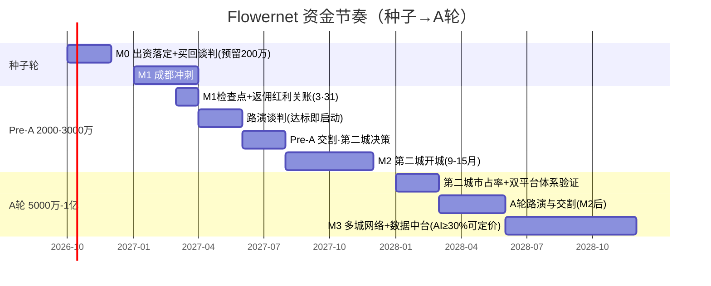

# Flowernet 融资时点与规划分析

> 明鉴 · 融资规划分析师 · 基于已确认事实推演（design-01/02 · 2026-09-09）
> 口径纪律：51%=投票权非分红权；GP=多股东有限公司；外部资本只进 LP 层不进控制层；对赌一律公司层（2025 执复 27 号路径）；种子→Pre-A→A 轮逐段只答于总三问：钱怎么花 / 何时要 / 什么结果。
> 目标命题：**融资不是"钱花完才要"，而是"里程碑到手、估值叙事成立才要"**——时点由里程碑触发，不由现金枯竭触发。

---

## 一、第一轮融资（Pre-A 2000-3000万）何时启动

### 1.1 触发信号清单（三条硬性 + 一条财务）

| 信号 | 阈值 | 缺了会怎样 |
|---|---|---|
| ① 成都验证 M1 达标 | 动销 1200+（现值 750） | 估值叙事建立在租来的牌上，谈不到好价 |
| ② 授权买回/作价落地 | 声通壳交割（预留 200 万） | "先落地授权链再承诺回报"红线（redteam #4） |
| ③ 成都现金流账成型 | 月毛利 160-200 万持续 2-3 个月 | 经营现金流证明缺位，财务方视为口径混淆 |
| ④ 现金水位预警 | 账上现金 < 6 个月运营成本 | 资金谈判需 3-6 个月，预警即启动路演，非枯竭才启动 |

**必须靠融资才启动的里程碑**：第二城开城、数据端口扩城（P2）、区仓复制、组织系统沉淀——种子 1000 万只覆盖成都打透+端口 P1（前 6 个月只承诺两件事，redteam #2），其余 250 万（IP 期权/区仓/技术 AI）为期权式预留、靠白嫖通道启动。

**不融资能撑到哪**：种子 + 成都毛利 160-200 万/月 + 新签 1200 元/店回血 + 返佣红利（6 现金+6 CPC，至 3·31 财年关账）——**现金流可无限滚动，但只守成都一城**。不融资的真实代价不是没钱，是丢时间窗：3·31 返佣红利、声通授权一年窗口、杭州/上海 70%+ 盘口窗口、2029 递表日历，全在 M1 后 6-12 个月内闭合。

### 1.2 最优窗口（种子→Pre-A）

```
种子交割(M0, 0-2月) → M1 冲刺(6-9月) → [9-11月: 达标即路演]
→ [11-12月: Pre-A 交割, 资金在第二城决策前到位]
→ [最迟第15月: M2 第二城开城, Pre-A 全部解锁用途]
```
窗口三重约束：**3·31 财年返佣红利尾段（12 月前把"成都账"打到最好看）**、成都 SOP 成型（可复制的最小单元=Pre-A 的交付物）、第二城决策（选城等市占率地图，钱不等决策、决策不等钱，两线并行）。

### 1.3 三种情形（A/B/C）与时点

| 情形 | 判断 | 融资时点 | 动作 |
|---|---|---|---|
| A 成都盈利跑正 | 毛利显著 > 现金支出，自造血 | **可晚融**：推迟至第二城决策确定后（约 12-15 月） | 少稀释、从容谈判；Pre-A 只用于扩城 |
| B 持平 | 毛利 ≈ 支出 | **按计划融**：M1 达标即启动，11-12 月进场 | 标准路径，Pre-A 2000-3000 万如期 |
| C 亏损 | 毛利覆盖不了支出 | **提前融保命**：M1 中段（约 7-8 月）谈过桥/可转债先行 | 动用种子"其余 250 万"缓冲把时点后推；代价=估值打八折或出让上浮，用可转债把定价推迟到 M1 数据出来 |

**C 情形预案优于讨论**：Pre-A 谈崩不影响生存——路线 C（保守滚动，design-02 §四）靠成都毛利续命，但宣布放弃 M2 扩城时间窗，是最后兜底不是选项。

---

## 二、第二轮（Pre-A/A 轮）股东关系处理

### 2.1 资源方股东（于总/吴总/紫阳）在第二轮的角色

资源方是层③股东、**不是层② LP**——第二轮稀释的是资金平台扩池，不稀释层③股权，除非顶层控股层面增发。据此给四项待遇：

| 条款 | 内容 | 为什么 |
|---|---|---|
| 优先认购权 | 按持股比例认购新发份额，可跟投保比例或书面放弃 | 防被动摊薄；资源方想加码以老股东价跟投，不占新 LP 额度 |
| 反稀释保护 | **加权平均**反稀释（不用完全棘轮） | 完全棘轮吓走新资本；加权平均在保护与可融资性之间取中 |
| 第二轮跟投窗口 | 新资本进场时给资源方 30 天同价跟投窗口 | 参与感延续（redteam #3：合伙人≠纯 LP） |
| 不担 LP 对赌义务 | 对赌只挂公司层与新增财务 LP | 双重身份利益错位防微杜渐 |

### 2.2 新财务 LP vs 老股东平衡（怎么进）

- **进层方式**：新 LP 增资有限合伙（层②），**不触碰层①/层③股权结构**——物理隔离即第一道防稀释。
- **三层反稀释各归其位**：外部 LP 有反稀释（防后续低价轮）；资源方有优先认购（防被动摊薄）；创始人"发起人反稀释 + 投票权不稀释"（防控盘被击穿）。
- **信息分层**：LP 拿财务知情权+审计权，不进董事会；资源方拿董事会战略信息流——两套信息流，互不越界。
- **利益同向机制**：同一套里程碑既是 LP 对赌标的、也是创始人期权解锁标的——资本赢=公司达标=创始人拿期权，零和变同向。

### 2.3 防稀释击穿 51% 投票权（怎么保）

1. **外部资本只进层②**（design-01 红线：前三轮控盘方不稀释）；2. **章程另行约定表决权比例**——有限公司允许表决权与分红权分离约定，即使未来顶层增发，章程 ≥51% 仍成立；3. **期权池放顶层控股、以里程碑解锁**，与 51% 身份治理不混淆（期权是超额对赌报酬）；4. **增发须创始人优先认购补足或书面接受摊薄**；5. 若资源方介意"51% 观感"（于总 A/B 中间层案），用**表决权委托/一致行动人协议**替代直接比例。

### 2.4 对赌条款设计（怎么退）

| 件 | 设计 |
|---|---|
| 里程碑对赌 | 赌体量/份额/行业地位同款：成都动销 1200+、单城 GMV 抽成毛利、城市数、数据接入份额；达标=创始人期权解锁，同向 |
| 回购 | 未达里程碑或到期未上市 → 公司按**本金+门槛收益（年化 8% 类）**回购 LP 份额 |
| 义务主体 | **公司层**，2025 执复 27 号路径下创始人个人不兜底（这是"愿意跟所有资本对赌"的前提） |

---

## 三、GP / LP 权责利全景矩阵

| 维度 | GP（用户方·振宇） | 资源方 LP（于总/吴总/紫阳） | 财务 LP（外部基金） |
|---|---|---|---|
| **权** | 执行事务合伙权=51% 表决权载体；经营决策/人事/业务方向主动掌舵；子公司"谁强谁操盘" | 董事席位 + 重大事项清单式否决（增资/并购/解散/担保/超预算/关联交易/份额转让）+ 子公司绝对否决 | 知情权（定期报告）+ 财务审计权 + 合伙协议明列表决事项（同清单，无经营话语权） |
| **责** | 业绩对赌落地（公司层）；信义义务+逐年审计+决议留痕（防影子董事/人格否认）；定期向 LP 报告；关联交易防火墙 | 资源作价交割确权（先工商证实，紫阳声通系以登记为准）；不越日常经营；僵局 30 天再议/仲裁 | 出资按期实缴（违约有罚则）；不干预经营（越界干预或失有限责任保护）；保密 |
| **利** | 控盘护城河 + 里程碑期权（目标倒推，Elon Musk 式）；管理费 1.5-2%/年；超额 carry 20-30% | 按股分红 + 子公司动态收益权（谁强谁操谁多拿）+ 参与感 | 优先回本 + 门槛收益（年化 8% 类）+ 超额浮动，按里程碑分期实缴降风险 |
| **进** | 种子 1000 万经友趣（家族载体）进层①/层③ | 现金+资源作价入股顶层控股（层③）；紫阳先确证、可转债过渡 | A 轮起增资有限合伙（层②），可转债或增资 |
| **退/保护** | 反稀释 + 投票权不稀释 + 个人不兜底；上市/并购/传承 | 股份回购 + 业绩对赌可回售（公司承接）+ 否决清单成文防架空 | 回购/份额转让/IPO 三选，进场前写死进合伙协议 |

> 一句话：**GP 用 51% 主动掌舵换"愿意被对赌"；资源方用出资换"在场感与清单否决"；财务 LP 用不出席换"钱的安全与退路"。**

---

## 四、退出设计（四路径）

| 路径 | 适用场景 | 定价 | 谁用 |
|---|---|---|---|
| **回购** | 里程碑未达 / 上市延迟 / LP 期限到期 | 本金 + 门槛收益（年化 8% 类），或约定估值×份额；义务主体=公司层 | LP 保底退出；资源方业绩对赌回售同通道 |
| **股权/份额转让** | LP 资金期限压力、中途想撤 | 最近一轮估值 × 流动性折价（10-20%）；GP 优先受让权 | LP 提前套现；转让须 GP 同意 |
| **IPO（港股 H 股）** | 主路径：2026H2 财务规范化 → 2029 递表 → 2030 挂牌 | 市值×份额；估值锚=港股 SaaS **3-4x PS**，**AI 收入 ≥30% 才被定价**（M3 数据中台即为此布局） | 全体股东主退出通道 |
| **并购** | 2030 前上市窗口不顺 / 垂直整合被收购 | EBITDA 或 PS 倍数（通常低于 IPO 估值，但快、现金化） | 备选；整体出售后按分配序结算 |

**用户怎么保**：用户不"退"，靠三条焊死——① 51% 表决权物理隔离（外部资本只进层②+章程分离约定），任何退出路径不破控制层；② 回购义务一律公司层，个人不兜底；③ 创始人不卖老股变现（增值靠里程碑期权，路径与 LP 同向）。**每轮融资文件里必须同时签好"退出三选+回购触发价"，进场即锁退路**——资源方与 LP 的"怎么退"永远在"怎么进"之前谈定。

---

## 五、结论：融资时间轴（今天 → A 轮）



**资金节奏四要点**：① **现金红线**：账上 <6 个月成本即启动下一轮路演，谈判留 3-6 个月缓冲，永不枯竭式融资；② **每轮只干一轮的事**：Pre-A 只扩第二城，A 轮只建多城+中台——逐段解锁、逐段对赌，不超前花钱（"能不花钱的全投软硬件/体系架构做提前量"）；③ **出让纪律**：种子 15-20% 起步，Pre-A/A 轮出让跟里程碑对赌绑（达 M1 估值×出让×%），静态比例不谈；④ **三问闭环**：每一轮交割时点=上一轮里程碑兑现日+1 至 2 个月——于总问的"何时要"，答案永远是"结果出来那一刻"，不是"钱快没了那一刻"。

---

### 附 · 待确认项
1. 于总侧资金结构（自有/外部/共同出资比例）未定——决定 Pre-A 是纯新增还是含资源方置换；2. 市占率地图未到手，第二城与 Pre-A 叙事待补；3. 买回价格无锚（丁凯 100 万被质疑）——作价独立评估先行；4. 一切时点以 M1 实测数据为准，对外叙事禁止超出现有口径。

---
*flowernet-biz-analysis-C · 明鉴 · 2026-09-09 · 供第二轮融资文件与于总三问续答使用*
