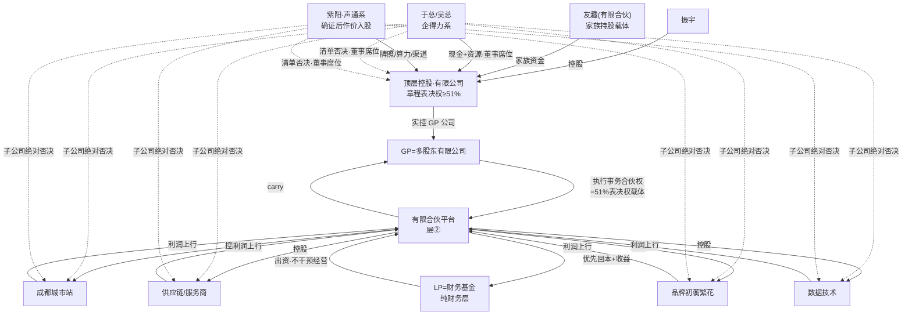

# Flowernet 股东结构与权责利体系深度分析

> 明鉴 · 治理架构分析师 · 基于已确认事实推演（design-01 GP/LP 双层架构设计 · 2026-09-09）
> 口径纪律：**51% = 投票权，非分红权**；GP=多股东有限公司；资源方≠纯 LP；对赌一律公司层（2025 执复 27 号）。

---

## 一、四层股东结构全景

### 1.1 各层股东、持有与权责利

| 层 | 股东 | 持什么 | 权 / 责 / 利 |
|---|---|---|---|
| 层① 经营控制层 | 振宇 · 友趣（家族有限合伙）· 顶层控股有限公司 | 顶层控股股权 | **权**：章程表决权 ≥51%、经营执行权集中；**责**：牵头对赌、决议留痕；**利**：控盘护城河 + 里程碑期权 |
| 层② 资金平台层 | GP=多股东有限公司（≥2 真实股东，层①实控）· LP=财务基金（纯财务层） | 有限合伙份额 / 执行事务合伙权 | GP 份额小话语权大，51% 经**执行事务合伙权**体现；LP 仅收益权 + 协议明列表决事项 |
| 层③ 资源方股东层 | 于总/吴总（企得力系）· 紫阳（声通系，先确证）· 广州橙果体系（阿凯：法务/招商） | 顶层控股股权 + 董事席位 | **权**：董事席位、知情权、清单式重大事项否决；**责**：资源作价交割、不越日常经营；**利**：参与感 + 分红/收益权（可动态） |
| 层④ 业务子公司层 | 成都城市站/鲜花服务商/供应链/品牌（初蘅、繁花）/数据技术 | 各子公司股权 | 谁强谁操盘：操盘方经营权 + 业绩对赌换更大收益权；资源方保留绝对否决；独立决议档案，出险不炸整盘 |

### 1.2 控制关系与利益流向图

### 1.3 51% 投票权在每层如何体现

- **层①**：有限公司章程对表决权/分红权作**分离约定**——表决 ≥51%、分红另议，此为 51% 的纸面落点。
- **层②**：51% 不靠份额靠 **GP 执行事务合伙权**（写入合伙协议）；财务 LP 只享收益权与明列事项表决。
- **层③**：资源方是 51% 的**被约束对象**——"股东层参与 + 经营层控盘"双轨，其权是清单式否决而非比例否决。
- **层④**：控股权归平台、经营权归操盘人，51% 让位于"谁强谁操"，资源方以限定重大事项的绝对否决对冲。
- **稀释防护**：前三轮控盘方不稀释；外部资本只进层②不进控制结构；创始人份额由反稀释 + 里程碑期权保护。**51% 是身份与治理，期权是超额对赌报酬**，两者不混淆。

---

## 二、资源方股东的设计（回应于总"要参与感"）

于总抗拒纯 GP-LP、吴总带资源身位，本质诉求一致：**不当"只出钱的 LP"，要身份（股东/董事）、知情、重大事项话语权，钱怎么花说得上话**。落点三件套：

1. **股权结构：顶层控股为主、子公司层为辅**——资源方以股东身份进层③入股顶层控股（持股权、任董事），并在其资源主导的子公司保留绝对否决；不走层②、不做财务 LP。
2. **董事席位 + 一票否决范围**：顶层董事会设资源方席位；否决权**仅限成文清单**（增资/减资/并购/解散/担保/超预算/关联交易/份额转让等特别决议）；配套僵局条款（僵持 30 天再议/仲裁/强制回购）防"无限否决拖死公司"。
3. **分红参与**：按持股分红；子公司层收益权/分红权可**动态分配**——资源作用大、操盘业绩好的子公司放大其收益权。

### 紫阳的特殊性：先确证，再给股

紫阳自称声通系股东、主张牌照/算力资源作价入股，但**身份未经工商证实、授权仅一年、估值有限**。铁序：① 谈判前以**工商登记 + 授权文件**确证股东身份与资源权属；② 确证前只给资源方 LP/候补身份，不给顶层股权；③ 确证后资源作价入股（非现金），走独立评估 + 关联交易防火墙；④ 声通大股东（华哥/汤总）未直接对话，架构生效前留确认节点。**先落地授权链，再对外承诺 3-5 年回报。**

### 资源方 vs 财务 LP 待遇差异表

| 维度 | 资源方股东（层③） | 财务 LP（层②） |
|---|---|---|
| 身份 | 顶层控股股东，可任董事 | 有限合伙份额持有人 |
| 出资 | 现金 + 资源作价（评估确权） | 纯现金 |
| 话语权 | 董事席位 + 清单否决 + 子公司绝对否决 | 仅协议明列特别决议事项 |
| 经营参与 | 重大事项参与、资源导入；不碰日常战术 | 不干预日常经营（明列） |
| 收益 | 按股分红 + 子公司动态收益权 | 优先回本 + 固定/浮动收益 + 里程碑解锁 |
| 风控 | 知情权 + 董事会信息流 | 知情权 + 财务审计权 |

---

## 三、GP 权责利清单（用户方·振宇侧）

| 类 | 条目 | 说明 |
|---|---|---|
| **权** | 经营决策权 | 经执行事务合伙权行使；日常经营/战术不经 LP |
| | 人事权 | 核心经营层任命归 GP/操盘方（谁强谁操盘） |
| | 业务方向 | 顶层董事会定，振宇方表决 ≥51% 主动掌舵 |
| | 投票权 51% | 章程 + 合伙协议双重落纸；前三轮不稀释 |
| **责** | 业绩对赌（公司层） | 义务主体=公司，个人不兜底（2025 执复 27 号路径） |
| | 定期向 LP 报告 | 经营/财务定期报告，对应 LP 知情权 |
| | 信义义务 | 忠实 + 勤勉；决策决议留痕，防影子董事 |
| | 防关联交易 | 声通/企得力资源作价：独立评估 + 决议留痕 + 防火墙 |
| **利** | carry | 建议 **20%–30%**（行业惯例 20%；控盘+操盘力强可上探 25–30%） |
| | 管理费 | 建议 **1.5%–2%/年**（谈判期可让步换里程碑松绑） |
| | 期权（目标倒推） | Elon Musk 式：**里程碑解锁、非时间解锁**，标的与对赌同款（成都动销 1200+/单城 GMV 抽成毛利/城市数/数据接入份额）；期权池放顶层控股，与资本对赌但前期不被干扰 |

---

## 四、LP 权责利清单（财务基金/外部资本）

| 类 | 条目 | 说明 |
|---|---|---|
| **权** | 知情权 | 定期经营/财务报告（与 GP 义务对应） |
| | 财务审计权 | 逐年审计（同时为 GP 隔离层合规要求） |
| | 重大事项否决 | 清单式：增资/减资/并购/解散/担保/超预算/关联交易/份额转让等 |
| | 退出权 | 回购 / 份额转让 / IPO 三选 |
| **责** | 出资义务 | 按协议实缴，逾期违约有罚则 |
| | 不干预日常经营 | 明列于合伙协议（越界干预或失有限责任保护） |
| | 保密 | 商业信息保密义务 |
| **利** | 优先回本 | 分配序：费用 → LP 本金 → 门槛收益 → carry |
| | 固定/浮动收益 | 门槛收益（如年化 8% 优先回报）+ 超额浮动 |
| | 按里程碑解锁 | 资金分期实缴，绑定成都验证、GMV 等指标降期初风险 |

LP 核心诉求一句话：**钱的安全 + 怎么进怎么退**——知情、审计、清单否决、优先回本、明确退路即全部答案，无需经营话语权。

---

## 五、进入与退出机制

### 5.1 怎么进（各轮融资路径）

| 进场方 | 轮次 | 路径 | 说明 |
|---|---|---|---|
| 自己人/家族 | 种子轮（1000 万） | 经**友趣（有限合伙）**出资入股层①/层③ | 钱层/权层分离，家族财产不混入业务公司，可兼作期权池 |
| 资源方（于总/吴总） | 天使/前 A | 现金+资源作价入股顶层控股（层③） | 增资为主；签股东协议 + 席位/否决清单 |
| 紫阳（声通系） | 前 A | 资源作价**先确权后入股** | 授权仅一年估值有限；可转债过渡待确证 |
| 财务基金 | A 轮起（M1 后） | 进层②做 LP（增资/可转债） | 只进资金平台，不进控制结构 |

### 5.2 怎么退

- **LP 三种退出**：① 回购——达里程碑/到期后 GP 或其指定方按约定价回购份额；② 份额转让——经 GP 同意转让（GP 优先受让权）；③ IPO/并购——上市或整体出售按序分配。三选写入合伙协议，进场前锁定。
- **资源方退出**：股份回购（股东协议约定触发）+ **业绩对赌可回售**——公司未达指标时资源方有权按约定价回售股份，防"投得进、退不出"。
- **创始人保护**：发起人**反稀释**（低价轮补偿）+ **投票权不稀释**（表决权比例不受增资摊薄）；资本只进层②即投票权不稀释的物理隔离。

### 5.3 对赌设计

| 维度 | 设计 |
|---|---|
| 与哪一层赌 | **公司层**（顶层控股/平台主体），不设个人对赌 |
| 赌什么 | 体量/份额/行业地位同款指标：成都动销 1200+、单城 GMV 抽成毛利、城市数、数据接入份额 |
| 赌输怎样 | 公司层义务——触发回购/回售/估值调整；2025 执复 27 号路径下创始人**个人不连带兜底** |
| 与期权关系 | 同一套里程碑既锁 LP 对赌、又锁创始人期权解锁——**利益同向**：资本赢 = 公司达标 = 创始人拿期权，非零和 |

---

## 六、总权责利矩阵表

| 维度 | 创始人振宇 | GP 多股东公司 | 资源方股东（于/吴/紫阳） | 财务 LP | 友趣（家族载体） |
|---|---|---|---|---|---|
| **权** | 表决 ≥51%、战略方向、人事 | 执行事务合伙权、日常经营 | 董事席位、清单否决、子公司绝对否决 | 知情+审计、明列事项否决 | 家族侧出资与期权池管理 |
| **责** | 牵头对赌、决议留痕、不关联输送 | 公司层对赌、定期报告、信义义务 | 资源作价交割确权、不越日常经营 | 出资实缴、不干预经营、保密 | 出资到位、协议合规 |
| **利** | 控盘 + 里程碑期权 | 管理费 1.5–2% + carry 20–30% | 按股分红 + 动态收益权 + 参与感 | 优先回本 + 门槛收益 + 里程碑解锁 | 家族资产隔离 + 增值 |
| **进** | 章程 + 股东协议设立 | 注册多股东有限公司 | 增资/作价入股（先确证）；可转债过渡 | 增资有限合伙（A 轮起） | 种子资金入股层①/层③ |
| **退** | 上市/并购/传承 | 随平台退出结算 | 股份回购 + 对赌可回售 | 回购/转让/IPO 三选 | 清算/转让/传承 |
| **保护** | 反稀释 + 投票权不稀释 + 个人不兜底 | 责任以出资为限（隔离） | 否决清单成文 + 僵局条款 | 优先分配序 + 审计权 | 主体独立、与业务公司分离 |

---

## 七、红线复核（防架空闭环）

1. **否决权仅限清单**（增资/担保/并购等）+ 僵局条款——否决是防御不是治理；
2. **决策走决议留痕** + 逐年审计，防影子董事与"形式一人"人格否认；
3. **对赌走公司层**（2025 执复 27 号），创始人个人不兜底；
4. **关联交易防火墙**——声通/企得力作价一律独立评估 + 决议留痕；
5. **≥2 真实股东三条不破**：GP 公司与顶层控股均多股东 + 审计 + 留痕。

> 结论一句话：**层①要"主动掌舵的 51%"，层③要"被尊重的参与感"，层②要"钱的安全与退路"，层④要"谁强谁操、各担其责"——清单化否决、公司层对赌、决议留痕三条线，把权力焊在纸上。**
