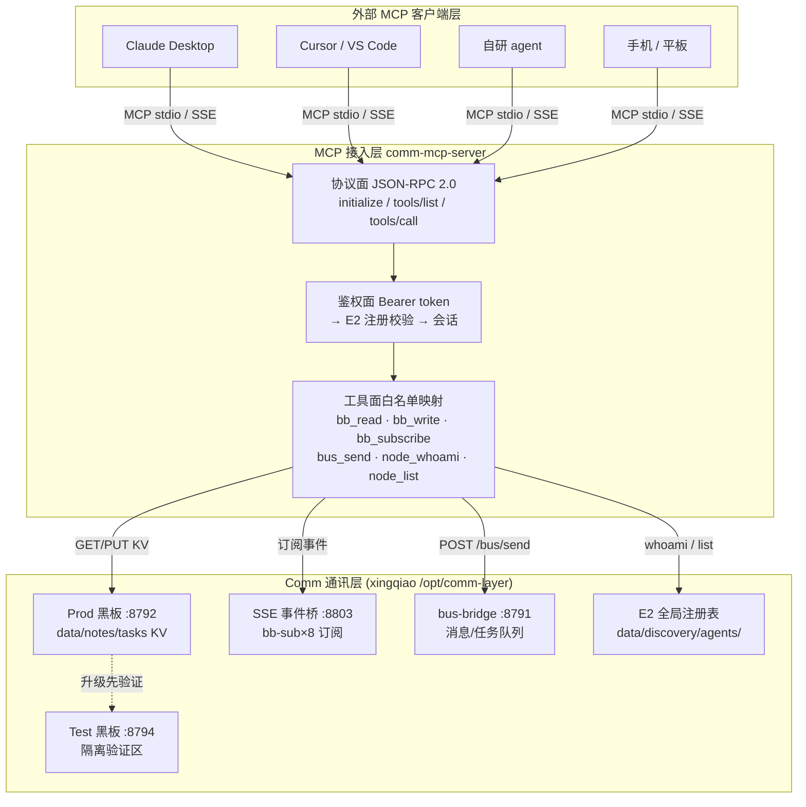
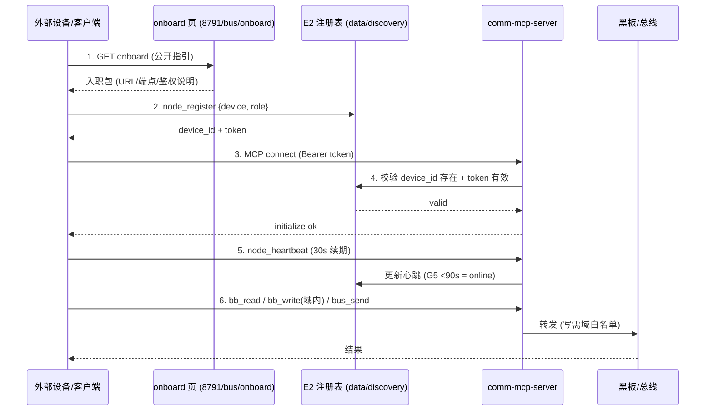
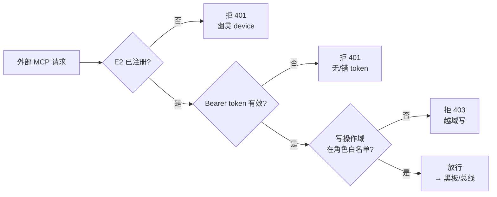
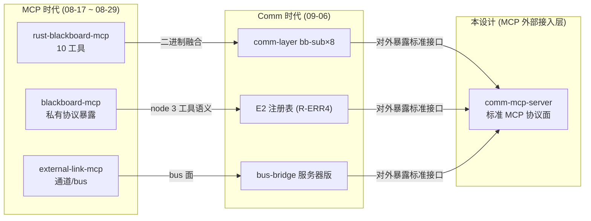

# MCP 外部接入层 · 架构图（Comm 架构版）

> 明鉴 v3 · 2026-09-06 · 配套 docs/mcp-external-access-design-v1.md

## 一、分层架构图（总览）

## 二、接入流程时序图（onboarding）

## 三、鉴权门流程（Φ9 越权拒绝）

## 四、演进路径图（MCP 时代 → Comm 时代）

---
*架构图 v1 · 明鉴 · 2026-09-06*
