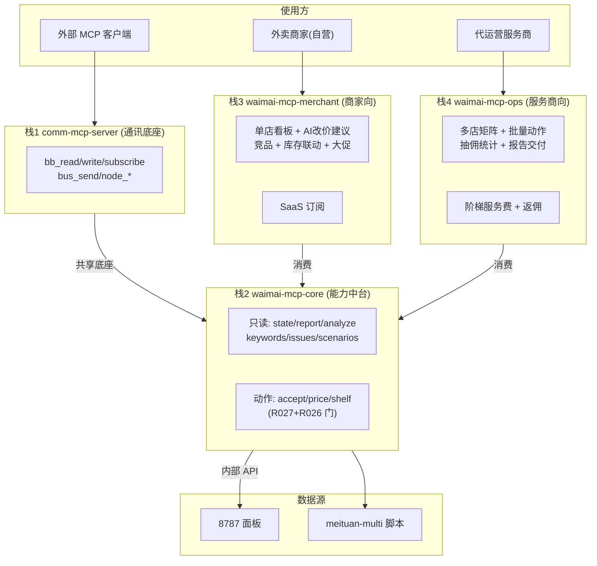
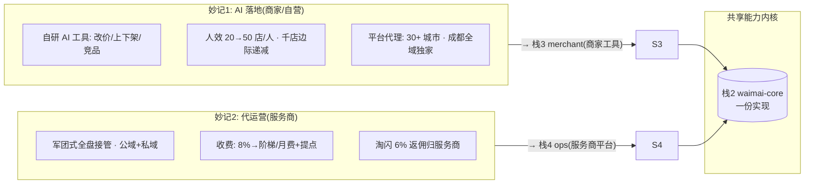

# 四栈 MCP · 关系架构图

> 明鉴 v3 · 2026-09-06 · 配套 mcp-four-stack-masterplan-v1.md

## 总架构（四栈 × 双用户对象）

```mermaid
flowchart TB
    subgraph USER["使用方"]
        U1["外部 MCP 客户端"]
        U2["外卖商家(自营)"]
        U3["代运营服务商"]
    end

    subgraph S1["栈1 comm-mcp-server (通讯底座)"]
        S1T["bb_read/write/subscribe<br/>bus_send/node_*"]
    end

    subgraph S2["栈2 waimai-mcp-core (能力中台)"]
        S2R["只读: state/report/analyze<br/>keywords/issues/scenarios"]
        S2A["动作: accept/price/shelf<br/>(R027+R026 门)"]
    end

    subgraph S3["栈3 waimai-mcp-merchant (商家向)"]
        S3T["单店看板 + AI改价建议<br/>竞品 + 库存联动 + 大促"]
        S3S["SaaS 订阅"]
    end

    subgraph S4["栈4 waimai-mcp-ops (服务商向)"]
        S4T["多店矩阵 + 批量动作<br/>抽佣统计 + 报告交付"]
        S4S["阶梯服务费 + 返佣"]
    end

    subgraph SRC["数据源"]
        D1["8787 面板"]
        D2["meituan-multi 脚本"]
    end

    U1 --> S1
    U2 --> S3
    U3 --> S4
    S1 -->|共享底座| S2
    S3 -->|消费| S2
    S4 -->|消费| S2
    S2 -->|内部 API| D1
    S2 --> D2
```

## 栈 3/4 用户对象差异（妙记依据）

```mermaid
flowchart LR
    subgraph M1["妙记1: AI 落地(商家/自营)"]
        A1["自研 AI 工具: 改价/上下架/竞品"]
        A2["人效 20→50 店/人 · 千店边际递减"]
        A3["平台代理: 30+ 城市 · 成都全域独家"]
    end
    subgraph M2["妙记2: 代运营(服务商)"]
        B1["军团式全盘接管 · 公域+私域"]
        B2["收费: 8%→阶梯/月费+提点"]
        B3["淘闪 6% 返佣归服务商"]
    end
    M1 -->|"→ 栈3 merchant(商家工具)"| S3
    M2 -->|"→ 栈4 ops(服务商平台)"| S4

    subgraph STACK["共享能力内核"]
        S2[("栈2 waimai-core<br/>一份实现")]
    end
    S3 --> S2
    S4 --> S2
```

---
*四栈关系图 v1 · 明鉴 · 2026-09-06*
