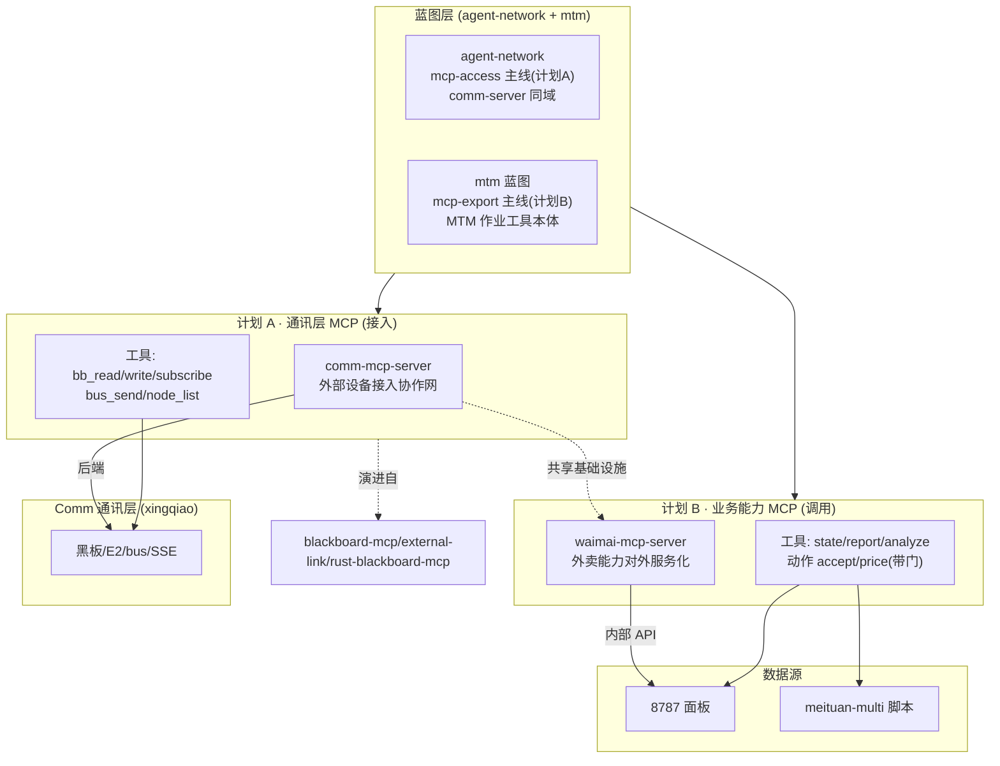

# 两层 MCP 化 × Comm 架构 · 关系总图

> 明鉴 v3 · 2026-09-06 · 计划 A(mcp-access) + 计划 B(mcp-export)

## 总览：MCP 化的两个面

## 关系矩阵

| 关系 | from | to | 类型 |
|------|------|-----|------|
| 蓝图归属 A | agent-network | mcp-access 主线 | contains |
| 蓝图归属 B | mtm | mcp-export 主线 | contains |
| A 数据依赖 | comm-mcp-server | E2/bus/黑板 | depends_on |
| B 数据依赖 | waimai-mcp-server | 8787 面板 | depends_on |
| A↔B 共享 | comm-mcp-server | waimai-mcp-server | 复用(基础设施) |
| A 演进 | mcp-access | blackboard-mcp(考古) | evolves_from |
| B 演进 | mcp-export | 8787服务化分析(08-25) | evolves_from |
| SystemGraph | 资产图 | mcp-access + mcp-export 资产 | shown_as |

## SystemGraph 落位

| 落位 | 计划 A | 计划 B |
|------|--------|--------|
| 蓝图 Tab | agent-network(mcp-access 主线) | mtm(mcp-export 主线) |
| 跨节点资产图 | +comm-mcp-server(归 xingqiao) | +waimai-mcp-server(归 mac-mini) |
| 机制/关系图谱 | relations 边 agent-network↔mtm(经基础设施) | 同上 |
| 版本台账 | 随 agent-network v1.3+ | 随 mtm v1.1 |

---
*关系总图 v1 · 明鉴 · 2026-09-06*
