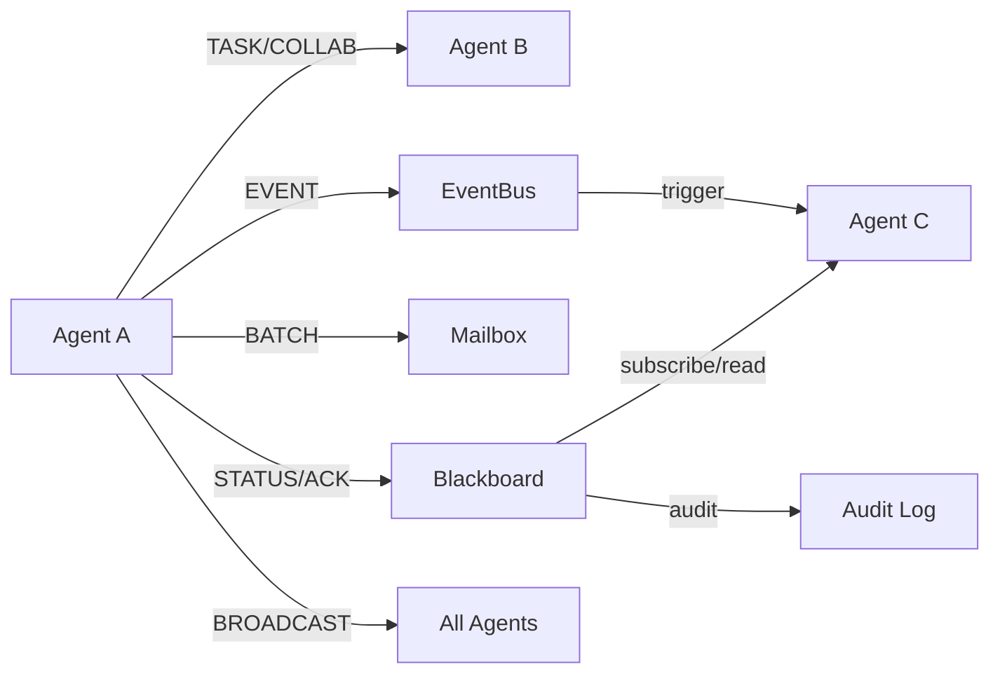
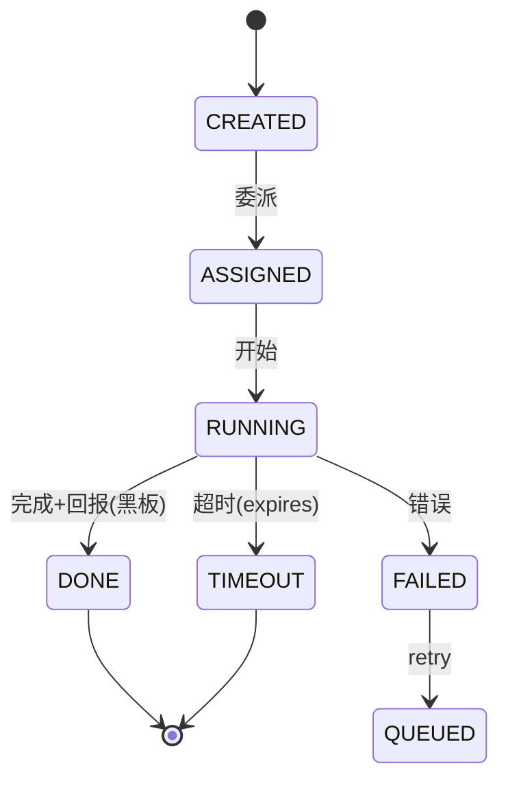

# CAHAC Protocol · 完整版规范 v1.0

> Cost-Aware Hybrid Agent Communication Protocol v1.0
> 起草/维护：HR 驾驶舱 · 2026-08-19 · 状态：**STANDARD（可实施）** · 前置：cahac-protocol-draft-v0.1.md（草案）
> 定位：多智能体通信的成本感知通道选择标准——按消息类型路由通信模式（点对点/黑板/邮箱/事件/广播）+ 回执-状态去耦 + 预算内建 + 安全审计
> 对标：A2A（Google）/ MCP（Anthropic）；差异化=成本感知通道选择 + ACK 去耦 + 预算内建

---

## 1. 引言

### 1.1 动机
实测：多智能体系统 61.8% 工具调用为确认回执（ack 风暴），26B tokens/19 天 98% 为上下文重发——同步点对点+全量上下文=成本平方级结构。

### 1.2 目标
1. 通信成本可预测、可预算、可熔断
2. 消息-状态去耦（确认/状态不进消息流）
3. 通道选择自动化（发信方零决策成本）
4. 可审计、可回放、可脱敏
5. 向后兼容（未实现方默认点对点）

### 1.3 非目标
- 不做统一语义/知识表示（留给领域层）
- 不做任务规划（仅通信层）
- 不绑定具体宿主（可移植设计）

### 1.4 术语
| 术语 | 定义 |
|---|---|
| Agent | 通信参与者（会话/进程） |
| Channel | 通信模式（p2p/blackboard/mailbox/eventbus/broadcast） |
| Blackboard | 共享状态区（topic 命名空间） |
| Mailbox | 文件系统任务队列 |
| Envelope | 统一消息信封（所有通道共用头） |
| CostCap | 任务级成本上限 |

## 2. 总体架构



## 3. 消息信封（Envelope）——统一格式

```json
{
  "cahac": "1.0",
  "id": "msg-<uuid>",
  "type": "TASK|COLLAB|STATUS|ACK|EVENT|BATCH|BROADCAST",
  "channel": "p2p|blackboard|mailbox|eventbus|broadcast",
  "sender": "<agent-id>",
  "recipient": "<agent-id>|*|topic:<name>",
  "thread": "<thread-id>",
  "priority": "P0|P1|P2",
  "cost_cap": 2000000,
  "dedup_key": "<stable-key>",
  "ts": "2026-08-19T12:00:00Z",
  "expires": "2026-08-19T13:00:00Z",
  "payload": { },
  "signature": "hmac-sha256:<base64>"
}
```

**字段规则**：id 全局唯一；dedup_key 幂等；cost_cap 任务级预算（0=无限制）；expires 可选（TTL）；signature v1.0 可选（启用时必填）。

## 4. 消息分类法（Message Taxonomy）

| 类型 | 代码 | 语义 | 通道 | 必答 | 生命周期 | 成本权重 |
|---|---|---|---|---|---|---|
| 实质任务 | TASK | 委派执行并回报 | p2p | 是 | CREATED→ASSIGNED→RUNNING→DONE/FAILED/TIMEOUT | 1.0 |
| 协作协商 | COLLAB | 多轮对齐 | p2p（线程内） | 是 | SESSION（线程） | 0.8 |
| 状态更新 | STATUS | 进度/资源/告警 | blackboard | 否 | 状态带 version+ttl | 0.1(写)/0.05(读) |
| 确认回执 | ACK | 「收到✓」 | blackboard | 否 | 无（写入即达） | 0.05 |
| 事件通知 | EVENT | 触发式告警 | eventbus | 否 | 持久化可重放 | 0.5 |
| 批量任务 | BATCH | 低优先级队列 | mailbox | 异步 | 任务卡状态机 | 0.05 |
| 全员广播 | BROADCAST | 紧急/制度/窗口 | broadcast | 是 | 即时 | 10.0 |

**硬规则**：STATUS/ACK 禁止走消息通道（通道选择器强制黑板）；BROADCAST 仅三类白名单（urgency=emergency/policy/restart）且 ≤月 5 次。

## 5. 通道选择器（Channel Selector）

### 5.1 决策算法
```
CHANNEL(msg):
  if msg.type in (STATUS, ACK): return blackboard
  if msg.type == BATCH: return mailbox
  if msg.type == BROADCAST:
      if msg.urgency in (emergency, policy, restart) and frequency_ok(msg): return broadcast
      else: reject(msg, code=FORBIDDEN_BROADCAST)
  if msg.type == EVENT: return eventbus
  if msg.priority == P0 and msg.type == TASK: return p2p   # 高优直接
  if cost_estimate(msg) > msg.cost_cap: return reject(msg, code=BUDGET_EXCEEDED)
  return p2p
```

### 5.2 成本权重表（预算核算基准）
| 通道 | 权重 | 含义 |
|---|---|---|
| broadcast | 10.0 | N 会话全唤醒 |
| p2p | 1.0 | 单会话完整上下文 |
| eventbus | 0.5 | 按订阅唤醒 |
| blackboard 写 | 0.1 | 一次写入 |
| blackboard 读 | 0.05 | 按需拉取 |
| mailbox | 0.05 | 增量文件处理 |

### 5.3 默认安全
- 通道不确定/规则冲突 → 走 p2p（宁可多花不可漏达）
- cost_cap 超限 → 拒绝并发回 BUDGET_EXCEEDED（或降级本地模型处理）

## 6. 黑板协议（Blackboard Protocol）

### 6.1 命名空间
`topic := <domain>.<name>`，例：ops.status / task.registry / alert / registry.changelog

### 6.2 操作 API
| 操作 | 语义 | 权限 |
|---|---|---|
| PUT(topic, key, value, ttl) | 写入/更新状态 | topic 属主 |
| GET(topic, key) | 读取 | 读权限（默认开放） |
| LIST(topic, prefix) | 列出 | 读权限 |
| SUBSCRIBE(topic, pattern, cb) | 订阅变更（事件驱动） | 读权限 |
| DELETE(topic, key) | 删除 | 属主 |
| AUDIT(topic, since) | 变更审计 | 治理者 |

### 6.3 并发与冲突
- 写前查灯（agent_light）→ 写（agent_lock exclusive）→ 释放——已与红绿灯协议统一
- 冲突解决：last-writer-wins + version 字段；高价值 topic 用 compare-and-swap

### 6.4 审计格式
`{ts, agent, topic, key, old, new, op}`——append-only 日志，可回放

## 7. 邮箱协议（Mailbox Protocol）

### 7.1 目录与命名
`mailbox/<agent-id>/inbox/`（投递方写）、`done/`、`failed/`

### 7.2 任务卡 Schema
```json
{ "task_id": "t-<uuid>", "envelope": {...}, "priority": "P0", "deadline": "...",
  "state": "QUEUED|RUNNING|DONE|FAILED|TIMEOUT", "retries": 0, "max_retries": 2 }
```

### 7.3 状态机
QUEUED → RUNNING → DONE | FAILED → (retry≤max) → QUEUED | TIMEOUT

### 7.4 容量与防积压
- inbox 上限 100 文件/agent；超限投递返回 MAILBOX_FULL
- TTL 24h 清理；failed/ 周清理

## 8. 事件协议（Event Protocol）

### 8.1 事件 Schema
`{event_id, ts, source, type, payload, dedup_key, severity}`

### 8.2 注册事件类型（v1.0 基线）
| type | 语义 | 订阅方 |
|---|---|---|
| cost.alert | 成本熔断/配额预警 | HR/协调者 |
| store.alert | 店铺异常（掉线/拒单率） | 运营/HR |
| task.completed | 任务完成 | 委派方 |
| agent.offline | 会话离线 | 协调者 |
| risk.detected | 风控信号 | HR/合规 |

### 8.3 幂等与重放
- dedup_key = 源事件指纹（如 SHA256(payload)），重复事件直接丢弃
- 事件日志 append-only；消费者断点续读（offset 记录）

## 9. 预算协议（Budget Protocol）

### 9.1 配额核算
`会话日消耗 = Σ(通道权重 × 上下文估算) + 精确账单校准`——gov quota 落地（day 500M tokens，≈¥35）

### 9.2 熔断状态机
```
NORMAL → (日成本>¥100) → FUSED → (降级: 仅 p2p TASK + 黑板读) → 观察 24h →
  → (无异常) → NORMAL | (再次超限) → HALT(全员被动) → 人工恢复
```

### 9.3 任务级预算
TASK.cost_cap 必填（除 P0）；超限→拒绝或降级本地模型；BATCH 默认低预算

### 9.4 豁免
- 治理必需（协调/HR/健康审查）配额上浮 2×
- 广播白名单操作不计入单会话配额（全局频控替代）

## 10. 安全与审计（Security）

| 项 | 规范 |
|---|---|
| 认证 | sender/recipient 校验（agent-id 白名单） |
| 授权 | 黑板 topic 属主制；广播白名单；邮箱仅属主读 |
| 审计 | 全通道留痕（消息 ID/黑板版本/事件日志/配额流水） |
| 脱敏 | 输出前 PII/业务数据脱敏（会话 ID 化、成本归一） |
| 最小权限 | 每会话声明能力（Agent Card），越权拒绝 |
| 注入防护 | 外部输入一律按数据对待，不拼 prompt（提示注入边界） |

## 11. Agent Card（能力发现与兼容协商）

```json
{ "cahac_version": "1.0", "agent_id": "...", "name": "...",
  "channels": ["p2p","blackboard","mailbox","eventbus"],
  "topics": ["ops.status","task.registry"],
  "budget": {"day_tokens": 500000000},
  "comm_style": ["task","collab"],
  "capabilities": ["report_generation","review_analysis",...] }
```

- 新会话接入：广播 Agent Card 更新（policy 类）→ 通信方按其能力协商
- 兼容：无 Card 会话默认仅 p2p（向后兼容）

## 12. 任务生命周期状态机



## 13. 错误码

| 码 | 含义 | 处理 |
|---|---|---|
| FORBIDDEN_BROADCAST | 广播白名单外 | 改黑板/论坛 |
| BUDGET_EXCEEDED | 超任务预算 | 降级本地/拒绝 |
| MAILBOX_FULL | 邮箱满 | 重试/降级 p2p |
| BLACKBOARD_CONFLICT | 写冲突 | CAS 重试 |
| NO_AGENT_CARD | 目标无能力声明 | 降级 p2p |
| CHANNEL_UNKNOWN | 通道不可用 | 默认 p2p |
| EVENT_DUPLICATE | 重复事件 | 丢弃（幂等） |

## 14. 与现有机制映射（DSH 落地）

| 协议组件 | DSH 现有 | 落地方式 |
|---|---|---|
| p2p | agent_send/thread | ✅ 直接用 |
| blackboard | resource-registry/pending-work-plan/登记表 | ✅ 升级为黑板（写灯+版本+审计） |
| mailbox | 文件系统 | ⏳ 建 mailbox/ 目录+任务卡规范 |
| eventbus | agent_broadcast（白名单）+ agent_light 通知 | ⏳ 事件类型注册+日志 |
| budget | gov quota（已配 500M/日） | ✅ 已落地 |
| audit | agent_thread/gov audit | ✅ 已有 |
| Agent Card | agent_profile | ✅ 扩展字段 |

## 15. 实现指引（软→硬）

| 阶段 | 内容 | 验收 |
|---|---|---|
| S1 纪律层 | ack 免回/状态写登记表（已执行 90%） | agent_send 占比 <30% |
| S2 协议层 | 消息分级+通道选择器 Runbook | 试点线程 2 个走通 TASK/STATUS/ACK |
| S3 基础设施层 | mailbox/ 目录、事件日志、黑板审计 | 邮箱+事件全通 |
| S4 标准化 | Agent Card 全量 + 对外规范 | 新会话零配置接入 |

## 16. 版本与演进

- v1.0：本规范（基线，可实施）
- v1.1 候选：签名强制、跨宿主移植（A2A/MCP 适配器）
- 向后兼容：新增消息类型走 ADDITIVE（不破坏旧通道）
- 弃用规则：类型废弃需 2 版本过渡期

## 附录 A：完整消息示例

**TASK 示例**：
```json
{ "cahac":"1.0", "id":"msg-9f2a", "type":"TASK", "channel":"p2p",
  "sender":"session-a17a52f8", "recipient":"session-5a5368af",
  "thread":"thread-msxp8lx2", "priority":"P1", "cost_cap":2000000,
  "dedup_key":"task:phoneuse-lookup", "ts":"2026-08-19T12:00:00Z",
  "payload":{"action":"locate","target":"phoneuse","detail":"..."} }
```

**STATUS→黑板 示例**（替代 ack）：
```json
{ "cahac":"1.0", "id":"st-77c1", "type":"STATUS", "channel":"blackboard",
  "recipient":"topic:task.registry", "dedup_key":"task:phoneuse-lookup:status",
  "payload":{"task_id":"t-123","state":"DONE","result_summary":"..."} }
```

## 附录 B：黑板化回执 vs 消息回执（成本对比）

| 场景 | 消息回执（旧） | 黑板状态（CAHAC） |
|---|---|---|
| 10 个协作会话各回 1 次确认 | 10 × 全上下文轮次 | 1 次写入 + N 次按需读 |
| 相对成本 | 10.0× | ≈1.5× |
| 可观测 | 线程历史（膨胀） | 状态版本+审计 |

## 附录 C：与 A2A/MCP 对照

| 维度 | A2A | MCP | CAHAC v1.0 |
|---|---|---|---|
| 层次 | Agent 间任务委派 | 工具暴露 | **通信通道选择**（可兼容两者之上） |
| 焦点 | 互操作 | 能力接入 | **成本感知+状态去耦** |
| 预算 | 无 | 无 | **内建**（配额/熔断/cost_cap） |
| 定位 | 平级互补 | 平级互补 | 补充层（可与 A2A/MCP 共存） |

---
*CAHAC v1.0 STANDARD · HR · 2026-08-19 · 完整版规范（草案 v0.1 → v1.0：补全信封/状态机/错误码/安全/Agent Card/示例/映射/实现指引）*

## 17. 风险治理与韧性（Risk Governance & Resilience）

### 17.1 治理机制（PDCA 环）

| 环节 | 机制 | 频率 |
|---|---|---|
| 登记 | 风险登记表（7 类 24 项基线，2026-08-19，见附录 D） | 立项时+变更时 |
| 监控 | 日审（成本/异常 🔴）/ 事件（cost.alert/store.alert/risk.detected）/ 周检 | 日/周 |
| 响应 | 熔断状态机（§9.2 NORMAL→FUSED→HALT）+ 事件驱动告警 | 即时 |
| 复盘 | 月复盘（风险再评估 + 配额校准 + 新风险入表） | 月 |

### 17.2 韧性设计（降级链）

| 故障 | 降级链 |
|---|---|
| 黑板不可用 | 登记表文件备份 → 临时 p2p 状态同步（限低价值） |
| 邮箱积压 | 降级 p2p（仅 P0）→ 容量告警 |
| 事件丢失 | 日志重放（offset 续读） |
| 云端不可用 | 本地模型兜底（分类/摘要类） |
| 成本超限 | FUSED（仅 p2p TASK+黑板读）→ HALT（被动） |

### 17.3 新调研/架构衔接（J39）

任何新架构/调研/工具立项前：
1. 运行 scripts/risk-enumeration.py --topic <主题> 生成穷举模板
2. 按 7 类穷举 → 概率×影响定级 → 对策（高×高必防）
3. 登记风险表（附录 D 追加）+ registry
4. 高×高防线未就绪 → 不立项（或限试点）

## 附录 D：风险登记表基线（2026-08-19，CAHAC 相关 24 项）

> 完整版见 architecture-risk-assessment.md；此处登记 v1.0 生效时的基线，随迭代追加

| ID | 风险 | 类 | 概率×影响 | 防线 | 状态 |
|---|---|---|---|---|---|
| R01 | ack 风暴复发 | 通信 | 高×高 | 配额✅+日审✅+黑板化(S2) | 监控中 |
| R02 | 成本反弹 | 成本 | 中×高 | 熔断✅+阶段门禁✅ | 监控中 |
| R03 | 黑板单点故障 | 架构 | 中×高 | 红绿灯✅+备份✅+双写⏳ | 部分就绪 |
| R04 | 恢复节奏失控 | 治理 | 中×高 | 阶段门禁硬卡✅ | 监控中 |
| R05 | 通道选择器误判 | 架构 | 低×高 | 默认安全 p2p✅ | 已就绪 |
| R06 | 安全事件 | 外部 | 低×高 | 审计✅+最小权限✅ | 已就绪 |
| R07 | 协议落地阻力 | 治理 | 高×中 | 审计+自动降级 | 试点期 |
| R08 | 黑板化试点失败 | 实施 | 高×中 | 渐进试点+登记表示范 | 试点期 |
| R09 | 日审疲劳 | 治理 | 高×低 | 自动熔断为主+周审 | 已就绪 |
| R10 | 本地路由质量不足 | 成本 | 中×中 | 质量门槛+回退 | 设计中 |
| R11 | 邮箱积压 | 架构 | 中×中 | TTL+容量上限 | S3 实现 |
| R12 | 事件丢失 | 架构 | 中×中 | 日志重放 | S3 实现 |
| R13 | 黑板写竞争 | 架构 | 中×中 | topic 属主（红绿灯） | 已就绪 |
| R14 | 线程膨胀 | 通信 | 中×中 | 线程 TTL/归档 | 规划中 |
| R15 | 直接沟通失控 | 通信 | 中×中 | 消息分级+通信预算 | 试点期 |
| R16 | 缓存命中下降 | 成本 | 低×中 | 保活+共享前缀稳定 | 规划中 |
| R17 | 精确计量延迟 | 成本 | 中×中 | 计量常态化 | 待办 |
| R18 | 配额误伤 | 成本 | 中×低 | 校准+豁免 | 已就绪 |
| R19 | 消息丢失/重复 | 通信 | 低×中 | 幂等+重试 | 已就绪 |
| R20 | 广播滥用 | 通信 | 低×高 | 白名单+频控 | 已就绪 |
| R21 | 宿主机制冲突 | 实施 | 中×中 | 先软后硬 | 规划中 |
| R22 | 恢复期数据缺失 | 实施 | 中×中 | R1 优先执行 | 待办 |
| R23 | 学术 n=1/脱敏 | 学术 | 中×中 | 泛化抽象+脱敏 | 论文期 |
| R24 | 供应商/平台变化 | 外部 | 中×中 | 本地缓冲+合规边界 | 监控中 |

> 更新规则：新风险经 J39 穷举后追加（R25+），状态变更随月复盘更新。