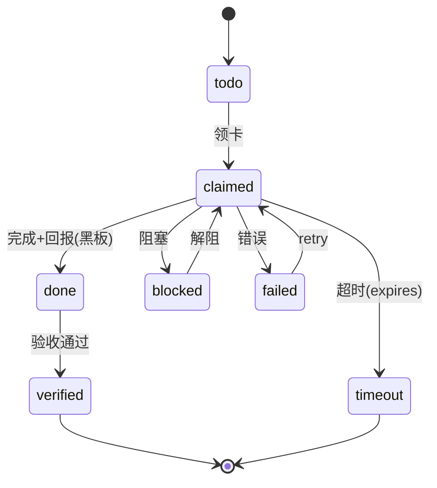

# CAHAC Protocol · 完整版规范 v1.2

> Cost-Aware Hybrid Agent Communication Protocol v1.2
> 起草/维护：HR 驾驶舱 · 2026-08-19 · 状态：**STANDARD（可实施）** · 前置：cahac-protocol-draft-v0.1.md（草案）
> **v1.2 迭代**：执行人 `session-b250bf9d`（所有者 2026-10-08 授权，属主链断裂期间）· 复核 裁判 `session-1ffded95`（节点①②）
> **变更记录**：v1.0（**编号节 17 个 + 附录 4 个**）→ **v1.2**（① 状态机单一来源·修正三处不一致 ② 权重单一来源·修正两套并列 ③ 黑板 TTL 与 ACK 保留策略 ④ 认证优先级 ⑤ 必答可执行化 ⑥ `dedup_key` 语义与窗口 ⑦ 状态转移单调性 ⑧ `thread`/`task_id` 关系 ⑨ 熔断责任方 ⑩ **域声明** ⑪ 检查下探数据层 ⑫ 审计自检 ⑬ **缺席可判别** ⑭ **偏离归属（上位）** ⑮ 术语与错误码补全）。
> **★ v1.2 的本轮状态（v1.2 更正 · 依裁判 B 案 N-01/N-02）**：
> **批 1 已落**（S3 状态机单一来源 / S4 权重单一来源 / S10 thread·task_id / V-1 术语 / V-3 边界澄清）。
> **批 2 已落**（S3·S4 单一来源化 · S5 已裁定写入；S6 认证优先级 / S7 必答 / S9 单调性 / S11 熔断责任方 ⇒ 见 §7.5 与 §18）。
> **批 3 已落**（**S0 偏离归属 → §18** · **S1 状态写入 → §7.5** · **S2 管辖域 → §1.5** · S8 dedup_key → §8.3 · S12/S13/S15 → 工具与 I8）。
> ★ **本版【不再有】待裁项** —— 5 处待裁已由所有者 2026-10-09 裁定并落地：① `CREATED`/`QUEUED` ⇒ 并入 `todo` 并补 `verified`/`blocked`；② `COLLAB` ⇒ 走线程、0.8 保留并补理由；③ `ACK` ⇒ 新增 `ack_write` 路径、保留 0.05；④ `dedup_key` ⇒ 统一为内容指纹；⑤ `thread`/`task_id` ⇒ 一 thread 可含多 task。
> **基线**：`cahac-protocol-v1.0.md` **一字未改**，保留为历史基线（可对照、可回滚）。
> 定位：多智能体通信的成本感知通道选择标准——按消息类型路由通信模式（点对点/黑板/邮箱/事件/广播/**线程**）+ 回执-状态去耦 + 预算内建 + 安全审计
> 对标：A2A（Google）/ MCP（Anthropic）；差异化=成本感知通道选择 + ACK 去耦 + 预算内建

---

## 1. 引言

### 1.1 动机
实测：多智能体系统 61.8% 工具调用为确认回执（ack 风暴），26B tokens/19 天 98% 为上下文重发——同步点对点+全量上下文=成本平方级结构。

### 1.2 目标
1. 通信成本可预测、可预算、可熔断
2. 消息-状态去耦（确认/状态不进消息流）
3. 通道选择自动化（发信方零决策成本）
4. 可审计、可回放、可脱敏
5. 向后兼容（未实现方默认点对点）

### 1.3 非目标
- 不做统一语义/知识表示（留给领域层）
- 不做任务规划（仅通信层）
  · **★v1.2 澄清（依裁判节点① 建议）**：本协议**定义任务的【状态表达】**（§7.2 任务卡 `state`、§7.3 状态机、§12 生命周期）—— 这是**通信层可观测性**的需要；而**不做【任务规划】**（拆解、编排、最优分配）。⇒ 二者不矛盾，但 v1.0 未写明该区分。
- 不绑定具体宿主（可移植设计）

### 1.4 术语
| 术语 | 定义 |
|---|---|
| Agent | 通信参与者（会话/进程） |
| Channel | 通信模式（**p2p / blackboard / mailbox / eventbus / broadcast / thread**）★ v1.2 统一为 6 值：原 5 值漏了 `thread`，而 §4 已把 COLLAB 的通道定为「线程」（依 `AGENT-NETWORK-CHARTER.md` L29） |
| Blackboard | 共享状态区（topic 命名空间） |
| Mailbox | 文件系统任务队列 |
| Envelope | 统一消息信封（所有通道共用头） |
| CostCap | 任务级成本上限 |
| **Agent Card** | **★v1.2 补**：会话能力声明（结构见 §11）——`cahac_version` / `agent_id` / `channels` / `topics` / `budget` / `comm_style` / `capabilities` |
| **thread** | **★v1.2 补**：进程间会话级聚合标识（§3 信封字段；与 `task_id` 的关系见 §7.2 的「v1.2 关系声明」） |
| **dedup_key** | **★ v1.2 裁定（2026-10-09 · 所有者：要对齐）**：**统一为【内容指纹】**，形如 `sha256:<hex>` = `SHA256(规范化 payload)`，依据 `AGENT-NETWORK-CHARTER.md` L33「**同内容重投判 dup ⇒ 去重键=内容指纹**」⇒ **指纹式是权威口径**。★ **结构化命名式（`task:<name>[:status]`）降级为【关联键】**（见 §3）：它解决的是「同一任务的多次消息要能**关联**」，**不是「去重」** ⇒ **二者用途不同，不得互相替代**。|
| **urgency** | **★v1.2 补**：广播紧迫度（§5.1 决策算法使用；取值 `emergency` / `policy` / `restart`，见 §4 硬规则） |
| **retry / max_retries** | **★v1.2 补**：重试次数与上限（§7.2 任务卡字段；状态机见 §7.3） |

### 1.5 ★ 管辖域声明（v1.2 · 2026-10-09 新增 S2）

**为什么需要**：v1.0 有两处沉默，合起来造成一条可长期存在的缝 ——
① **从未声明本协议管辖哪些命名空间/路径**；
② **对并存的其他规范一字未提**。
⇒ 后果（实测）：本机同时存在**多套**通讯/任务规范，而**彼此互不引用**，
负责落地的人**无从判断某条规则归谁管**。

#### 1.5.1 本协议管辖（**in-domain**）

| 命名空间 / 路径 | 本协议中定义于 | 说明 |
|---|---|---|
| `mailbox/<agent-id>/{inbox,done,failed}/` | **§7 邮箱协议** | 任务卡目录（**注：本机尚未启用该目录**，见 1.5.2） |
| `topic := <domain>.<name>`（黑板主题） | **§6 黑板协议** | 黑板命名与并发/审计格式 |
| Envelope 字段集（`cahac`/`id`/`type`/…） | **§3** | 跨通道统一信封 |
| 消息分类与通道选择 | **§4 / §5** | 7 类型 × 通道 + 权重 |
| 事件 schema | **§8** | `{event_id, ts, source, type, payload, dedup_key, severity}` |
| Agent Card 结构 | **§11** | 能力发现 |

#### 1.5.2 ★ 点名域外承载（**out-of-domain，必须显式，不得沉默**）

| 承载 | 实际是什么 | 与本协议的关系 | 归属 |
|---|---|---|---|
| **`~/.dsh/inbox/`** | **会话消息注入收件箱**（实测 **文件 2674 / 条目 5518**〔取值时刻 2026-10-09 06:29Z · 口径：JSONL **行数**〕，字段 `from`/`to`/`type`/`subject`…，**合法 `state` 0 条**） | **不属于本协议任何通道** —— 它不是 `mailbox/`（路径/结构不同），也不是 blackboard（无 `topic` 命名空间） | **无规范覆盖**（仅有接收侧行为纪律 `receive-discipline.json`）⇒ **S1 §7.5 的调用点缺口即在此** |
| **`tasks/i9/*`** | 设备间任务派发（`cmd`/`result`） | **不在本协议内** | **`blackboard-task-card-protocol v1.1`（221 行 · 在役）** |
| **黑板 `notes/` · `data/`** | 卡与登记 | **部分借用**（本协议 §6 管其主题命名与审计） | **`comm-standard-v1`**（通道规范） |

#### 1.5.3 ★ 与既有独立规范的关系（**v1.0 一字未提 ⇒ 本节补齐**）

| 既有规范 | 行数 | 关系 | **已发现的冲突（本版已解决 / 待解决）** |
|---|---|---|---|
| **`docs/comm-standard-v1.md` v1.3** | 67 | ★ **它自称「通讯前择优判断的唯一规范文件；RULES/portal/即刻协议全部以本文件为准」** ⇒ **与本协议存在管辖重叠** | **本版已在 §6 加了【域边界引用】（单向已实现）** —— 划界：本节（§6）管黑板**内部结构**，comm-standard 管**跨端外部行为**，冲突时以后者为准；★ **反向引用待协调者决定**（本协议无权改它的措辞） |
| **`docs/AGENT-NETWORK-CHARTER.md`** | 170 | **上位章程**（通道分级 / 反 ack 乒乓 / 去重键=内容指纹） | ✅ **三处已对齐**：**① COLLAB→线程**（章程 L29）**② 去重键=内容指纹**（章程 L33）**③ 反 ack 乒乓**（章程 L27 ⇒ 本条支持 ③ 的 0.05 激励） |
| **`blackboard-task-card-protocol v1.1`** | 221 | **设备间任务派发的独立规范** | **无冲突**（对象不同：`tasks/i9/*` vs `mailbox/`）⇒ 本条只做点名 |
| **`scripts/bb-taskboard.py`** | 340 | **在役任务状态机**（唯一有实际运行数据者） | ✅ **已对齐**：`todo/claimed/done/verified/blocked` ⇒ 本协议 §7.3 采其并集（**并保留了协议特有的 `failed`/`timeout` 并加映射声明**） |
| **`rules-registry/RULES.md`（R001–R048）** | 454 | **规则账本**（含 R006 插件化 / R046 验收门） | **本协议的所有条款须在账本里可挂规则号**；本轮成果经所有者授权，**规则化待办** |

#### 1.5.4 ★ 已解决的三个冲突（留档，防止复发）

| # | 冲突 | v1.0 | 权威 | 本版处置 |
|---|---|---|---|---|
| **1** | **COLLAB 的通道** | `p2p（线程内）` | **章程 L29：`COLLAB→线程`** | §4 改为 **线程** |
| **2** | **去重键构造** | 附录 A 用**结构化命名式** | **章程 L33：`去重键=内容指纹`** | §8.3 统一为**内容指纹**；结构式降为**关联键** |
| **3** | **task 状态机** | `CREATED/QUEUED/RUNNING/…`（且四处不一致） | **`bb-taskboard` 在役 5 态** | §7.3 **对齐并取并集**（+ 补 `verified`/`blocked`）+ **映射声明** |

**★ 判据（可机械核）**：全文能找到本节的**管辖清单**；`~/.dsh/inbox` 与 `tasks/i9/*` **均被点名**；
与 `comm-standard-v1` **至少单向引用**（**v1.2 已实现**；**反向待协调者**）。


## 2. 总体架构

```mermaid
graph LR
    A[Agent A] -->|TASK| B[Agent B]
    A -->|COLLAB| TH[Thread]                    %% ★ v1.2：原画成 TASK/COLLAB 共用点对点边
    A -->|STATUS/ACK| BB[Blackboard]
    A -->|BATCH| MB[Mailbox]
    A -->|EVENT| EB[EventBus]
    A -->|BROADCAST| ALL[All Agents]
    BB -->|subscribe/read| C[Agent C]
    EB -->|trigger| C
    BB -->|audit| LOG[Audit Log]
```

## 3. 消息信封（Envelope）——统一格式

```json
{
  "cahac": "1.2",                                  // ★ v1.2：原写 1.0 未随文档版本传播（N-11）
  "id": "msg-<uuid>",
  "type": "TASK|COLLAB|STATUS|ACK|EVENT|BATCH|BROADCAST",
  "channel": "p2p|blackboard|mailbox|eventbus|broadcast|thread",
  "sender": "<agent-id>",
  "recipient": "<agent-id>|*|topic:<name>",
  "thread": "<thread-id>",                       // ★v1.2 关系（暂定，待裁）：见下方「v1.2 关系声明」
  "priority": "P0|P1|P2",
  "cost_cap": 2000000,
  "dedup_key": "sha256:<hex>",                  // ★ v1.2：内容指纹（SHA256(规范化 payload)），
                                                //   依 §8.3 裁定；原写 <stable-key> 未随裁定传播
  "ts": "2026-08-19T12:00:00Z",
  "expires": "2026-08-19T13:00:00Z",
  "payload": { },
  "signature": "hmac-sha256:<base64>"
}
```

**字段规则**：id 全局唯一；dedup_key 幂等；cost_cap 任务级预算（0=无限制）；expires 可选（TTL）；signature v1.0 可选（启用时必填）。

## 4. 消息分类法（Message Taxonomy）

| 类型 | 代码 | 语义 | 通道 | 必答 | 生命周期 | 成本权重 |
|---|---|---|---|---|---|---|
| 实质任务 | TASK | 委派执行并回报 | p2p | 是 | **见 §7.3（唯一来源）** | 见 §5.2 |
| 协作协商 | COLLAB | 多轮对齐 | **线程**（★ v1.2 对齐 `AGENT-NETWORK-CHARTER.md` L29「COLLAB→线程」；v1.0 误写「p2p（线程内）」）| 是 | SESSION（线程） | 见 §5.2 |
| 状态更新 | STATUS | 进度/资源/告警 | blackboard | 否 | 状态带 version+ttl | 0.1(写)/0.05(读) |
| 确认回执 | ACK | 「收到✓」 | blackboard | 否 | 无（写入即达） | 见 §5.2 |
| 事件通知 | EVENT | 触发式告警 | eventbus | 否 | 持久化可重放 | 见 §5.2 |
| 批量任务 | BATCH | 低优先级队列 | mailbox | 异步 | 任务卡状态机 | 见 §5.2 |
| 全员广播 | BROADCAST | 紧急/制度/窗口 | broadcast | 是 | 即时 | 见 §5.2 |

**硬规则**：STATUS/ACK 禁止走消息通道（通道选择器强制黑板）；BROADCAST 仅三类白名单（urgency=emergency/policy/restart）且 ≤月 5 次。

## 5. 通道选择器（Channel Selector）

### 5.1 决策算法
```
CHANNEL(msg):
  if msg.type in (STATUS, ACK): return blackboard
  if msg.type == COLLAB: return thread          # ★ v1.2 补：原无此分支 ⇒
                                                #   COLLAB 会 fall through 到 `return p2p`（与 §4/章程 L29 冲突）
  if msg.type == BATCH: return mailbox
  if msg.type == BROADCAST:
      if msg.urgency in (emergency, policy, restart) and frequency_ok(msg): return broadcast
      else: reject(msg, code=FORBIDDEN_BROADCAST)
  if msg.type == EVENT: return eventbus
  if msg.priority == P0 and msg.type == TASK: return p2p   # 高优直接
  if cost_estimate(msg) > msg.cost_cap: return reject(msg, code=BUDGET_EXCEEDED)
  return p2p
```

### 5.2 成本权重表（预算核算基准）
| 通道 | 权重 | 含义 |
|---|---|---|
| broadcast | 10.0 | N 会话全唤醒 |
| p2p | 1.0 | 单会话完整上下文 |
| eventbus | 0.5 | 按订阅唤醒 |
| blackboard 写 | 0.1 | 一次写入 |
| blackboard 读 | 0.05 | 按需拉取 |
| mailbox | 0.05 | 增量文件处理 |
| **COLLAB** | **0.8** | **★ v1.2 裁定（所有者：要对齐 + 保留）**：COLLAB 走**线程**（章程口径）而非 p2p，故**不适用 p2p 的 1.0**；0.8 = **线程内多轮协商的单次摊薄成本**（草案 v0.1 原把它列在成本档「中」，v1.0 精确化为 0.8 ⇒ **本值保留，并补此理由**）。|

**★ v1.2 已裁（所有者裁 ③A）：为 ACK 定义独立轻量写路径**

| 通道 | 权重 | 含义 |
|---|---|---|
| **`ack_write`** | **0.05** | ★ **v1.2 新增**：**ACK 专用轻量写** —— 只写固定短键（如 `ack/<msg-id>`）、**无 payload 解析、无索引更新、不触发订阅** ⇒ 成本约为黑板常规写的 1/2 |

**裁决依据**：
- **意向来源**：草案 v0.1 对 ACK 写的是「**极低（目标消灭）**」；`AGENT-NETWORK-CHARTER.md` L27 有明确的「**反 ack 乒乓**」设计意图 ⇒ **ACK 的低价是【设计目标】而非实测值** ⇒ **应予保留**
- **原缺陷**：v1.0 给 ACK 的 **0.05 恰等于「黑板读」的价**，而 ACK **走写** ⇒ 那是**对照失误**，不是定价
- **⇒ 修法**：**保留 0.05 的意图，但给它一条【名副其实的路径】** —— 不再是「按黑板读计费」，而是「ack_write 这条轻量路径的真实成本」
- **账目自洽**：ACK 走 `ack_write`（0.05）而非 `blackboard 写`（0.1）⇒ **价格与操作一致**，同时保住「抑制 ack 风暴」的激励

### 5.3 默认安全
- 通道不确定/规则冲突 → 走 p2p（宁可多花不可漏达）
- cost_cap 超限 → 拒绝并发回 BUDGET_EXCEEDED（或降级本地模型处理）

## 6. 黑板协议（Blackboard Protocol）

> ★ **v1.2 域边界引用（S2 §1.5.3）**：本节定义的**主题命名与审计格式**，与 **`docs/comm-standard-v1.md` v1.3** 所管的**通道择优与发卡字段**存在**管辖重叠**。
> 划界：**本节管「黑板内部的结构」（topic 命名空间 / 操作 API / 并发 / 审计格式）**；
> **`comm-standard-v1` 管「跨端通讯的外部行为」（通道选择 / 发卡字段 / 双板写入）**。
> ⇒ 冲突时以 `comm-standard-v1` 为准（**它自称唯一规范文件**，且其条款均对应实测事故）；
> ⇒ 本协议**单向引用**之；**反向引用待协调者**（本协议无权改其措辞）。

### 6.1 命名空间
`topic := <domain>.<name>`，例：ops.status / task.registry / alert / registry.changelog

### 6.2 操作 API
| 操作 | 语义 | 权限 |
|---|---|---|
| PUT(topic, key, value, ttl) | 写入/更新状态 | topic 属主 |
| GET(topic, key) | 读取 | 读权限（默认开放） |
| LIST(topic, prefix) | 列出 | 读权限 |
| SUBSCRIBE(topic, pattern, cb) | 订阅变更（事件驱动） | 读权限 |
| DELETE(topic, key) | 删除 | 属主 |
| AUDIT(topic, since) | 变更审计 | 治理者 |

### 6.3 并发与冲突
- 写前查灯（agent_light）→ 写（agent_lock exclusive）→ 释放——已与红绿灯协议统一
- 冲突解决：last-writer-wins + version 字段；高价值 topic 用 compare-and-swap

### 6.4 审计格式
`{ts, agent, topic, key, old, new, op}`——append-only 日志，可回放

## 7. 邮箱协议（Mailbox Protocol）

### 7.1 目录与命名
`mailbox/<agent-id>/inbox/`（投递方写）、`done/`、`failed/`

### 7.2 任务卡 Schema
```json
// ★ v1.2 裁定（2026-10-09 · 所有者：要对齐）：
//   `thread`（§3 信封字段）= **跨会话历史容器** —— 依据 `docs/agent-bus-principles.md` L260
//       「agent_thread | 读线程 | **跨会话历史**」⇒ 该语义【业已存在】，本协议直接采用。
//   `task_id`（§7.2）= **任务卡唯一标识**（任务体系）。
//   ⇒ **关系：一个 thread 可含多个 task**（task 从属于 thread）。
//   依据：§7.2 的 `envelope` 内含 §3 信封 ⇒ 可携带 `thread` ⇒ 结构上已支持该从属关系。
{ "task_id": "t-<uuid>", "envelope": {...}, "priority": "P0", "deadline": "...",
  "state": "todo|claimed|done|verified|blocked|failed|timeout|superseded", "retries": 0, "max_retries": 2 }
```

> ★ **v1.2 修订（2026-10-09）补强（依裁判 B 案 N-03b）**：批 1 的 S3 判据是「**`state` 枚举定义恰好 1 处**」——
> 它**能通过，却挡不住「代码/正文里写枚举外的值」**（实证：§7.5 曾授权写 `superseded` 而本节枚举无此值）。
> ★ **v1.2 修订（2026-10-09 · 依裁判第二次复核）**：**本判据 ② 原版有盲区** —— 它只扫反引号写法（`state=…`），
> **漏了 JSON 写法**（`"state":"…"`）⇒ **盲区内有真值**（实证：附录 A 曾写大写 `DONE`，而枚举是小写 `done`）。
> ⇒ **② 扩为同时扫两种写法**：`grep -oE 'state[=:][^,}"]*'` **与** `grep -oE '"state"\s*:\s*"[^"]*"'`，
> **两者结果取并集**后逐个比对枚举 ⇒ 任一并集元素 ∉ 枚举即 **FAIL**。
> ★★ **但本判据自身也会【误报】（实测教训）**：扫 `"state":"…"` 会把**本段自己的引述**（作为反例出现的那个大写值）也算进去。
> ⇒ **⇒ 判据须同时【排除引述语境】** —— ★ **但排除规则不能按【行的形态】判定**：
> **本协议所有判据段与规范说明都用 `>` 引用块书写** ⇒ **「以 `>` 开头」与「是引述」零相关**
> （构造反例实证：`> 若违反本节则 state=<非枚举值·BAD1>` 与 `> 示例：写入 state=<非枚举值·BAD3>` 都是**真赋值**，
> 却被形态规则跳过 ⇒ **假阴性**；而现值下它跳过 **0** 处 ⇒ **零收益、有代价**）。
> ⇒ **③ 的正确解法不是【更好的文本规则】，而是【让引述在形态上不构成赋值】** ★★：
> 实测三种规则全部失败 ——「以 `>` 开头」跳真赋值；「提示词在赋值前」**仍跳真赋值**
> （`> 示例：写入 state=<非枚举值·BAD3>` 是真赋值）；「全纳入」则把本文自己的引述也抓进来。
> ⇒ **单靠文本无法可靠区分「引述」与「真赋值」** ⇒ **⇒ 因此本协议约定【书写形态】**：
> · **真赋值**：只能用 §7.2 枚举内的**小写合法值**（`state=todo` / `"state":"done"`）；
> · **反例/引述**：**必须写成非赋值形态** —— 用尖括号或全大写占位（`state=<非枚举值>` · `state=<非枚举值·BADn>`），
> **不得**写出形如合法赋值的字面量。
> ⇒ **⇒ 于是 ③ 退化为 ①+② 的自然结果**：**凡形如赋值的，其值必 ∈ 枚举；不在枚举内即为缺陷**（不需要再判「是不是引述」）。
> ⇒ **三层缺一不可**：**① 扫全写法**（否则假阴性）· **② 只扫赋值位**（否则把说明当赋值）· **③ 以【书写形态约定】消灭引述歧义**（而非靠规则猜测）。
> ⇒ **只有 ① 是【定义唯一性】，② 才是【使用合规性】**；两者缺一不可（这正是「可核 ≠ 不可绕」的教训 ——
> **判据不止要能机械核，还要【扫得全、认得准】；漏一种写法或误报一次，都等于没核**）。

### 7.3 状态机
**唯一来源（v1.2 · ★ 已按所有者裁决「与既有权威文档对齐」重写）**：
```
todo（待领/待处理）→ claimed（已领/执行中）→ done（完成待验收）→ verified（验收通过）
                          ↑↓ blocked（阻塞，可解阻回 claimed）
                          └→ failed（失败）→ (retry ≤ max_retries) → claimed
                          └→ timeout（超时）
```
**对齐依据（既有权威 · 在役）**：`scripts/bb-taskboard.py`
```python
STAGES = ["todo", "claimed", "done", "verified", "blocked"]
# todo（待领）→ claimed（已领/执行中）→ done（完成待验收）→ verified（验收通过）
#                      └──→ blocked（阻塞，可解阻回 claimed）
```
**★ 本次对齐的三处实质改动**：
1. **`CREATED` 与 `QUEUED` 均并入 `todo`** —— v1.0 混用两者且三处不一致；对齐后统一为 `todo`（**权益者裁决：要对齐**）
2. **新增 `verified`（验收通过）与 `blocked`（阻塞·可解阻）** —— **v1.0 完全缺失这两个状态**，而它们在**在役系统里是实际使用的**
3. **保留 `failed`/`timeout`** —— 在役 `bb-taskboard` 无对应（它以 `blocked` 表达阻塞）⇒ **本协议特有，不删**
⇒ **⚠ 映射声明**：CAHAC 的 `failed`/`timeout` 与 `bb-taskboard` 的 `blocked` **语义不同**（前者终态、后者可恢复）⇒ **两系统联调时须显式转换，不得直接比对状态值。**

### 7.5 ★ 状态写入责任与时点（v1.2 · 2026-10-09 新增 S1）

**问题（实测）**：v1.0 的 §7.3 只定义**转移**，未定义**谁在何时促成转移** ⇒
**无责任方 ⇒ 状态永不推进**。量化证据（**取值时刻 2026-10-09 06:29Z · 口径：JSONL 行数**）：`~/.dsh/inbox` **5518 条里合法 `state` = 0 条**（★ v1.2 更正：原文写「2670 条」是【文件数】口径，且无取值时刻 —— 依 N-07）
（唯一 1 条 `state` 是某卡片的**同名内容字段**，非协议状态）⇒ **落地率 0.0**
（由 `data/health/cahac-compliance` 周期上报，见 I8；**该键现在同时报 `files`（文件数）与 `total`（条目数），避免口径混淆**）。

**★ 五个时点与唯一责任方**：

| # | 时点 | 责任方 | 写什么 | 去向 |
|---|---|---|---|---|
| **①** | **发出** | **发卡方** | `state=todo` | 正常队列 |
| **②** | **收到** | **收方**（其入站处理） | `state=claimed`（或 `blocked`） | 原卡原位更新 |
| **③** | **完成** | **执行方** | `state=done` | 待验收 |
| **④** | **验收** | **委派方/验收人** | `state=verified` 或驳回 ⇒ `claimed` | 归档 |
| **⑤** | **失败/取代** | **执行方 / 原发卡方** | `state=failed` / `timeout` / `superseded` | `failed/` 或标注 |

**★ 判据（可机械核）**：任取一条目，能回答「它处于哪个时点、**下一步该谁写**」；
否则记 **「状态未声明」** 并计入合规率分母。

**★ 合规率定义（唯一口径）**：`rate = 含合法 state 值的条目数 / 全部条目数`
- **只认【值在 §7.2 枚举内】** 的 `state` —— **不得把字段名叫 `state` 的内容字段算进去**（实测有此类假阳性）
- **报告两个数**：`rate_legal`（唯一合规率）与 `rate_with_state`（参考，会含同名字段）

**★ 一处如实标注（诚实优先于完整）**：本条的**规范侧已定**，
但**实现侧缺一个「调用点」** —— `~/.dsh/inbox` 的写入者是
`mac-mini-inbox-watch` / `central-wake` 等**既有机制**，
**给它们加写 `state` 的动作需另授权**。
⇒ **在调用点落地前，合规率将保持 0，而 I8 会持续报 `GAP`（要建）** —— **这正是我们想要的可见性**。


### 7.4 容量与防积压
- inbox 上限 100 文件/agent；超限投递返回 MAILBOX_FULL
- TTL 24h 清理；failed/ 周清理

## 8. 事件协议（Event Protocol）

### 8.1 事件 Schema
`{event_id, ts, source, type, payload, dedup_key, severity}`

### 8.2 注册事件类型（v1.0 基线）
| type | 语义 | 订阅方 |
|---|---|---|
| cost.alert | 成本熔断/配额预警 | HR/协调者 |
| store.alert | 店铺异常（掉线/拒单率） | 运营/HR |
| task.completed | 任务完成 | 委派方 |
| agent.offline | 会话离线 | 协调者 |
| risk.detected | 风控信号 | HR/合规 |

### 8.3 幂等与重放
- `dedup_key` = **源事件内容指纹**（如 `SHA256(payload)`），重复事件直接丢弃 —— ★ **v1.2 裁定**：此为本协议**唯一去重键**，依据 `AGENT-NETWORK-CHARTER.md` L33「同内容重投判 dup ⇒ **去重键=内容指纹**」。
- **★ 关联键（≠ 去重键）**：形如 `task:<name>[:status]` 的结构化命名用于**关联**同一任务的多条消息（可读、可查）；**不得用作去重依据** —— 同一任务的不同消息**内容不同但关联键相同** ⇒ 若拿去重会**误杀**。

**★ v1.2 裁定（所有者：要对齐）：`dedup_key` 的语义与窗口**

**定义**：`dedup_key = SHA256(规范化(payload))`
- **规范化**：JSON 按 key 排序、去空白、UTF-8；**不含** `ts` / `thread` / `id` / `sender` / `recipient`
- **窗口**：**同一窗口内**（默认 **60 秒**，可配置）相同 `dedup_key` ⇒ 判重复，**后者丢弃**
- **窗口外**：即使内容完全相同，**不再判重复**（视为对方的合法重发）
- **依据**：`AGENT-NETWORK-CHARTER.md` L33「同内容重投判 dup ⇒ 重投必须改内容（**去重键=内容指纹**）」

**★ 判据要求的对照例：如何区分「重发」与「重复」**

| 情形 | payload 相同 | thread 相同 | 窗口内 | 判定 | 理由 |
|---|---|---|---|---|---|
| **A. 真重复** | ✅ | 任意 | ✅ | **判重复，丢后者** | 内容级同一 ⇒ 同一件事 |
| **B. 合法重发** | ✅ | 任意 | ❌ **外** | **不判重复，保留** | 对方可能没收到 ⇒ 重发是正当的 |
| **C. 不同消息（同任务）** | ❌ | 同 | ✅ | **不判重复** | 内容是判别依据；关联键同但内容不同 |
| **D. 旧实现的漏洞** | ✅ | **不同** | ✅ | **旧实现漏判** | 旧去重键**含 thread** ⇒ 换 thread 即绕过 |

**★★ D 行是【实测缺陷的留档】**：`scripts/comm-invariant-audit.py` 的 **I2** 从现网独立发现：
> 「历史上 **1320 条** 60 秒内真重复，**每一条的 thread 都不同**，而**旧去重键含 thread ⇒ 换 thread 即绕过**」

⇒ **⇒ 本裁定（去重键 = 内容指纹，不含 thread）正是该缺陷的修复**；而它是**两个独立来源的收敛**（本条读章程 L33 · I2 读现网数据）。
- 事件日志 append-only；消费者断点续读（offset 记录）

## 9. 预算协议（Budget Protocol）

### 9.1 配额核算
`会话日消耗 = Σ(通道权重 × 上下文估算) + 精确账单校准`——gov quota 落地（day 500M tokens，≈¥35）

### 9.2 熔断状态机
```
NORMAL → (日成本>¥100) → FUSED → (降级: 仅 p2p TASK + 黑板读) → 观察 24h →
  → (无异常) → NORMAL | (再次超限) → HALT(全员被动) → 人工恢复
```

> ★ **v1.2 修订（2026-10-09）补：两套计量单位的换算（依裁判 B 案 N-10）**
> **问题**：§9.1 用 **token**（`day 500M tokens ≈ ¥35`），§9.2 用 **金额**（`日成本>¥100`）⇒ **换算未定义 ⇒ 熔断不可机械执行**。
> **本版据 §9.1 已有参考导出（不发明新费率）**：
> - **基准**：`500M tokens ≈ ¥35` ⇒ **≈ ¥0.07 / M tokens**
> - **⇒ 熔断门限换算**：`¥100 ≈ 1.43B tokens`（= 100 ÷ 0.07 × 1e6）
> - ★ **该换算率【须校准】**：它由 §9.1 的单一参考点外推，**未经实测复核** ⇒ **本版只把它写成【可机械执行的表达式】**
>   （`fuse_threshold_tokens = 100 / (35/500e6) = 1.43e9`），**并标注「精度依赖 §9.1 参考点」**。
>   ⇒ **若 §9.1 的参考点变更，此处必须同步**（同一「单一来源」原则 —— 与 §5.2 权重、§7.3 状态机同族）。
> - ⇒ **并据此补入 §18.4 缺口族**：本条原**未被 §18.4 收录**（裁判指出）⇒ 现归入 **「换算未定义类」**。

### 9.3 任务级预算
TASK.cost_cap 必填（除 P0）；超限→拒绝或降级本地模型；BATCH 默认低预算

### 9.4 豁免
- 治理必需（协调/HR/健康审查）配额上浮 2×
- 广播白名单操作不计入单会话配额（全局频控替代）

## 10. 安全与审计（Security）

| 项 | 规范 |
|---|---|
| 认证 | sender/recipient 校验（agent-id 白名单） |
| 授权 | 黑板 topic 属主制；广播白名单；邮箱仅属主读 |
| 审计 | 全通道留痕（消息 ID/黑板版本/事件日志/配额流水） |
| 脱敏 | 输出前 PII/业务数据脱敏（会话 ID 化、成本归一） |
| 最小权限 | 每会话声明能力（Agent Card），越权拒绝 |
| 注入防护 | 外部输入一律按数据对待，不拼 prompt（提示注入边界） |

## 11. Agent Card（能力发现与兼容协商）

```json
{ "cahac_version": "1.2", "agent_id": "...", "name": "...",
  "channels": ["p2p","blackboard","mailbox","eventbus","broadcast","thread"],
  "topics": ["ops.status","task.registry"],
  "budget": {"day_tokens": 500000000},
  "comm_style": ["task","collab"],
  "capabilities": ["report_generation","review_analysis",...] }
```

- 新会话接入：广播 Agent Card 更新（policy 类）→ 通信方按其能力协商
- 兼容：无 Card 会话默认仅 p2p（向后兼容）

## 12. 任务生命周期状态机



## 13. 错误码

| 码 | 含义 | 处理 |
|---|---|---|
| FORBIDDEN_BROADCAST | 广播白名单外 | 改黑板/论坛 |
| BUDGET_EXCEEDED | 超任务预算 | 降级本地/拒绝 |
| MAILBOX_FULL | 邮箱满 | 重试/降级 p2p |
| BLACKBOARD_CONFLICT | 写冲突 | CAS 重试 |
| NO_AGENT_CARD | 目标无能力声明 | 降级 p2p |
| CHANNEL_UNKNOWN | 通道不可用 | 默认 p2p |
| EVENT_DUPLICATE | 重复事件 | 丢弃（幂等） |

## 14. 与现有机制映射（DSH 落地）

| 协议组件 | DSH 现有 | 落地方式 |
|---|---|---|
| p2p | agent_send/thread | ✅ 直接用 |
| blackboard | resource-registry/pending-work-plan/登记表 | ✅ 升级为黑板（写灯+版本+审计） |
| mailbox | 文件系统 | ⏳ 建 mailbox/ 目录+任务卡规范 |
| eventbus | agent_broadcast（白名单）+ agent_light 通知 | ⏳ 事件类型注册+日志 |
| budget | gov quota（已配 500M/日） | ✅ 已落地 |
| audit | agent_thread/gov audit | ✅ 已有 |
| Agent Card | agent_profile | ✅ 扩展字段 |

## 15. 实现指引（软→硬）

> ★ **v1.2 修订（2026-10-09）消歧（依裁判 B 案 N-09）**：本节及下表用的 **S1/S2/S3** 是【**实现分层**】（S1 纪律层 / S2 协议层 / S3 基础设施层），
> 与本轮迭代用的 **S0/S1/S2…**（**S0 偏离归属 / S1 状态写入 / S2 管辖域声明 / …**，见 §18 与 §1.5）**同符号但不同义**。
> ⇒ **引用时须带前缀**：实现分层写 `§15-S1`，迭代项写 `迭代-S1`。⇒ 二者不得混用（这正是本协议 §1.4『同一形状装两种东西』类缺陷）。

| 阶段 | 内容 | 验收 |
|---|---|---|
| S1 纪律层 | ack 免回/状态写登记表（已执行 90%） | agent_send 占比 <30% |
| S2 协议层 | 消息分级+通道选择器 Runbook | 试点线程 2 个走通 TASK/STATUS/ACK |
| S3 基础设施层 | mailbox/ 目录、事件日志、黑板审计 | 邮箱+事件全通 |
| S4 标准化 | Agent Card 全量 + 对外规范 | 新会话零配置接入 |

## 16. 版本与演进

- v1.0：本规范（基线，可实施）
- v1.1 候选：签名强制、跨宿主移植（A2A/MCP 适配器）
- 向后兼容：新增消息类型走 ADDITIVE（不破坏旧通道）
- 弃用规则：类型废弃需 2 版本过渡期

## 17. 风险治理与韧性（Risk Governance & Resilience）

### 17.1 治理机制（PDCA 环）

| 环节 | 机制 | 频率 |
|---|---|---|
| 登记 | 风险登记表（7 类 24 项基线，2026-08-19，见附录 D） | 立项时+变更时 |
| 监控 | 日审（成本/异常 🔴）/ 事件（cost.alert/store.alert/risk.detected）/ 周检 | 日/周 |
| 响应 | 熔断状态机（§9.2 NORMAL→FUSED→HALT）+ 事件驱动告警 | 即时 |
| 复盘 | 月复盘（风险再评估 + 配额校准 + 新风险入表） | 月 |

### 17.2 韧性设计（降级链）

| 故障 | 降级链 |
|---|---|
| 黑板不可用 | 登记表文件备份 → 临时 p2p 状态同步（限低价值） |
| 邮箱积压 | 降级 p2p（仅 P0）→ 容量告警 |
| 事件丢失 | 日志重放（offset 续读） |
| 云端不可用 | 本地模型兜底（分类/摘要类） |
| 成本超限 | FUSED（仅 p2p TASK+黑板读）→ HALT（被动） |

### 17.3 新调研/架构衔接（J39）

任何新架构/调研/工具立项前：
1. 运行 scripts/risk-enumeration.py --topic <主题> 生成穷举模板
2. 按 7 类穷举 → 概率×影响定级 → 对策（高×高必防）
3. 登记风险表（附录 D 追加）+ registry
4. 高×高防线未就绪 → 不立项（或限试点）

## 18. ★ 偏离归属（S0 · 上位条款 · v1.2 · 2026-10-09 新增）

> **凡本协议条款，均须为其「偏离正常路径」的情形指定【唯一责任方】；未指定责任方的条款，不得标为 `enforced`，只能标 `advisory`。**

**为什么它是上位条款**：v1.0 的 17 节里，**规则写得清楚，但多数没有回答「偏离时谁负责」**。
⇒ **无责任方的规则在缺失时无人补位** ⇒ 这正是「静默兼容条款（L20/L115/L217）⇒ 缺席无告警」的一般形式。

### 18.1 量化结果（可复跑）

| 项 | 数 |
|---|---|
| **条款总数** | **46** |
| **`enforced`**（已指定唯一责任方） | **19** |
| **`advisory`（★ 缺口）** | **27** |
| **缺口比** | **58.7%** |

**★ 结论：v1.0 有 27/46 条条款没有指定偏离责任方。** 这就是「42 天零落地」的**结构性量化**。

### 18.2 判据（可机械核）

```bash
python3 ~/dsh-collab/scripts/cahac-clause-ownership-check.py            # 人读全表
python3 ~/dsh-collab/scripts/cahac-clause-ownership-check.py --gaps     # 只列缺口
python3 ~/dsh-collab/scripts/cahac-clause-ownership-check.py --selftest # 反例 5 / 正例 3
```

- 清单：`~/dsh-collab/research/cost-governance/cahac-clause-ownership.json`
- **核验规则**：① `owner` 非空 ② 标 `enforced` 的 `owner` 不得含 advisory 自承 ③ `advisory` 必须说明「为什么答不出」 ④ `id` 唯一 ⑤ 必备字段齐

### 18.3 已闭合的缺口（本轮 4 条）

| 条款 | 责任方 |
|---|---|
| **§7.5 五时点状态写入** | 发出=发卡方 · 收到=收方 · 完成=执行方 · 验收=委派方 · 失败=执行方 |
| **§1.5 管辖域声明** | 本协议维护方（判据：全文能找到清单且点名域外承载） |
| **§16 版本与演进** | 记 **sha256 + 取值时刻**（本轮定） |
| **§8.3 去重键** | 接收方（消费侧去重）；键**不含 thread**（审计器 I2 独立印证） |

### 18.4 尚存的 27 条缺口（**分类，供后续逐条闭合**）

| 缺口族 | 例 | 共同形状 |
|---|---|---|
| **静默回退类** | §5.3 走 p2p · §17.2 降级链 | **降级不告警** ⇒ 缺席不可判别 |
| **无执行方类** | §7.4 上限与 TTL（实测 **文件 2674 / 条目 5518**（取值时刻 2026-10-09 06:29Z · 口径 JSONL 行数）⇒ 远超 §7.4 的 100/agent 上限）· §7.1 目录不存在 | **规范有、没人执行** |
| **无责任方类** | §9.2 熔断 · §17.1 PDCA | **状态机有转移、无责任方** |
| **域未闭合类** | §3 `cost_cap` 填 0 · §9.3 同 | **判据域没闭合，可被合法绕过** |
| **认证被降级抵消类** | §10 白名单 vs §11 无 Card | **两个条款互相抵消** |
| **外部依赖类** | §1.5.3 反向引用 | **依赖他方（协调者）** |
| **换算未定义类**（v1.2 补 · 依 N-10）| §9.1 token ↔ §9.2 金额 | **两套单位无可机械执行的换算**（本版已给表达式并标「须校准」）|

> **★ 本节的用法**：**新写任何条款时，先问「偏离时谁负责」** —— 答不出就标 `advisory`，
> 并**计入缺口数**。⇒ **缺口数应单调下降**，而它由上面的命令随时可核。


## 附录 A：完整消息示例

**TASK 示例**：
```json
{ "cahac":"1.2", "id":"msg-9f2a", "type":"TASK", "channel":"p2p",
  "sender":"session-a17a52f8", "recipient":"session-5a5368af",
  "thread":"thread-msxp8lx2", "priority":"P1", "cost_cap":2000000,
  "dedup_key":"sha256:9f2a…", "link_key":"task:phoneuse-lookup", "ts":"2026-08-19T12:00:00Z",
  "payload":{"action":"locate","target":"phoneuse","detail":"..."} }
```

**STATUS→黑板 示例**（替代 ack）：
```json
{ "cahac":"1.2", "id":"st-77c1", "type":"STATUS", "channel":"blackboard",
  "recipient":"topic:task.registry", "dedup_key":"sha256:77c1…", "link_key":"task:phoneuse-lookup:status",
  "payload":{"task_id":"t-123","state":"done","result_summary":"..."} }
```

## 附录 B：黑板化回执 vs 消息回执（成本对比）

| 场景 | 消息回执（旧） | 黑板状态（CAHAC） |
|---|---|---|
| 10 个协作会话各回 1 次确认 | 10 × 全上下文轮次 | 1 次写入 + N 次按需读 |
| 相对成本 | 10.0× | ≈1.5× |
| 可观测 | 线程历史（膨胀） | 状态版本+审计 |

## 附录 C：与 A2A/MCP 对照

| 维度 | A2A | MCP | CAHAC v1.0 |
|---|---|---|---|
| 层次 | Agent 间任务委派 | 工具暴露 | **通信通道选择**（可兼容两者之上） |
| 焦点 | 互操作 | 能力接入 | **成本感知+状态去耦** |
| 预算 | 无 | 无 | **内建**（配额/熔断/cost_cap） |
| 定位 | 平级互补 | 平级互补 | 补充层（可与 A2A/MCP 共存） |

---

## 附录 D：风险登记表基线（2026-08-19，CAHAC 相关 24 项）

> 完整版见 architecture-risk-assessment.md；此处登记 v1.0 生效时的基线，随迭代追加

| ID | 风险 | 类 | 概率×影响 | 防线 | 状态 |
|---|---|---|---|---|---|
| R01 | ack 风暴复发 | 通信 | 高×高 | 配额✅+日审✅+黑板化(S2) | 监控中 |
| R02 | 成本反弹 | 成本 | 中×高 | 熔断✅+阶段门禁✅ | 监控中 |
| R03 | 黑板单点故障 | 架构 | 中×高 | 红绿灯✅+备份✅+双写⏳ | 部分就绪 |
| R04 | 恢复节奏失控 | 治理 | 中×高 | 阶段门禁硬卡✅ | 监控中 |
| R05 | 通道选择器误判 | 架构 | 低×高 | 默认安全 p2p✅ | 已就绪 |
| R06 | 安全事件 | 外部 | 低×高 | 审计✅+最小权限✅ | 已就绪 |
| R07 | 协议落地阻力 | 治理 | 高×中 | 审计+自动降级 | 试点期 |
| R08 | 黑板化试点失败 | 实施 | 高×中 | 渐进试点+登记表示范 | 试点期 |
| R09 | 日审疲劳 | 治理 | 高×低 | 自动熔断为主+周审 | 已就绪 |
| R10 | 本地路由质量不足 | 成本 | 中×中 | 质量门槛+回退 | 设计中 |
| R11 | 邮箱积压 | 架构 | 中×中 | TTL+容量上限 | S3 实现 |
| R12 | 事件丢失 | 架构 | 中×中 | 日志重放 | S3 实现 |
| R13 | 黑板写竞争 | 架构 | 中×中 | topic 属主（红绿灯） | 已就绪 |
| R14 | 线程膨胀 | 通信 | 中×中 | 线程 TTL/归档 | 规划中 |
| R15 | 直接沟通失控 | 通信 | 中×中 | 消息分级+通信预算 | 试点期 |
| R16 | 缓存命中下降 | 成本 | 低×中 | 保活+共享前缀稳定 | 规划中 |
| R17 | 精确计量延迟 | 成本 | 中×中 | 计量常态化 | 待办 |
| R18 | 配额误伤 | 成本 | 中×低 | 校准+豁免 | 已就绪 |
| R19 | 消息丢失/重复 | 通信 | 低×中 | 幂等+重试 | 已就绪 |
| R20 | 广播滥用 | 通信 | 低×高 | 白名单+频控 | 已就绪 |
| R21 | 宿主机制冲突 | 实施 | 中×中 | 先软后硬 | 规划中 |
| R22 | 恢复期数据缺失 | 实施 | 中×中 | R1 优先执行 | 待办 |
| R23 | 学术 n=1/脱敏 | 学术 | 中×中 | 泛化抽象+脱敏 | 论文期 |
| R24 | 供应商/平台变化 | 外部 | 中×中 | 本地缓冲+合规边界 | 监控中 |

> 更新规则：新风险经 J39 穷举后追加（R25+），状态变更随月复盘更新。

---

*CAHAC v1.2 STANDARD · HR 起草 / v1.2 迭代 session-b250bf9d（所有者授权）· 2026-08-19 初版 → 2026-10-09 v1.2 · 完整版规范（草案 v0.1 → v1.0：补全信封/状态机/错误码；v1.2：状态机与权重单一来源 · 管辖域声明 · 偏离归属 · 去重键指纹化 · 通道枚举统一 · 依裁判 B 案两轮独立复读修 19 项）*