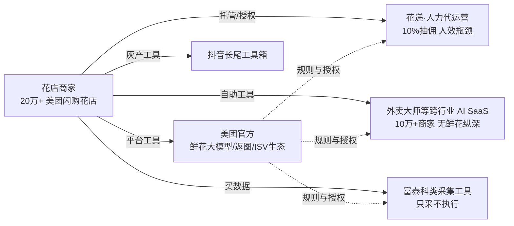

# 鲜花外卖/即时零售 AI 自动运营 + 鲜花代运营服务商 —— 竞品调研报告

> 调研日期：2026-09-07 ｜ 委托方：广州鲜花零售团队（自研 AI 外卖运营工具，人效 20→50 店/人，10 店矩阵 + 30+ 城市美团独家代理 + 成都全域即时零售独家）
> 方法：web_search 中文为主多组关键词 + 一手页面抓取交叉验证；软文/不可核验来源标注排除。

---

## 一、核心结论（≤1500 字）

**1. 「鲜花 × AI 自动运营」直接同层竞争者目前为空——细分是相对蓝海，但蓝海窗口由平台规则与官方工具演进决定。**
把赛道拆成三层看：**代运营层**有规模化玩家（花娃系"花递"，人力代运营为主）；**通用 AI 运营工具层**有跨行业大玩家（外卖大师、再惠等，未垂类鲜花）；**数据/工具长尾层**有灰产化小工具。但没有一家把「鲜花垂类经营知识 + 自动改价/上下架 + 竞品监控 + 库存联动」做成产品化 SaaS 或服务商作业平台。

**2. 最近的真竞对是"花递"（花娃独家授权，四川花递电子商务有限公司）——但它是人力代运营，不是 AI 工具，恰好印证两个产品方向的切入点。**
已核实：花娃对花店收 10% 订单佣金（0 元入驻、效果收费、佣金月结、花店收入实时到账，需花娃保证金 ≥1500 元），服务范围为美团外卖/淘宝闪购店铺的"全面诊断/排名提升/店铺包装/产品规划/节日活动配置/1对1指导"——典型人力密集型代运营。花娃还做「花递直卖」（自称"鲜花行业的 美团饿了么"，帮花店上线美团/点评/淘宝闪购/京东并出资推广）与「花娃微店」私域工具。**其模式瓶颈 = 人效**：10% 抽佣要覆盖运营人工，门店越多越依赖堆人。这直接支撑我方两个方向：① 把"花递式服务"产品化为商家自助 AI SaaS；② 把"20→50 店/人"的作业能力输出给花递这类抽佣玩家（作业平台 B 端化）。

**3. 平台侧才是最大变量：美团官方亲自下场鲜花经营工具，且监管正在收紧"平台/代运营强制改价"。**
2025 年 7 月美团闪购昆明生态大会发布"鲜花全产业链升级方案"：20 万家花店在闪购上线（2023 年消费规模超百亿）、推出**鲜花行业数据预测大模型**、上线"送前返图"、门店直送+三方分账——官方正在做"数据预测/返图"这类与我方重叠的能力，必须跑在官方开放能力之上做差异化（多平台聚合是差异点：美团+饿了么+抖音+淘宝闪购）。同时 2025-2026 美团"AI 改价"引发商家集体投诉（后台无修改记录、折扣由商家承担），2026 年 4 月《互联网平台价格行为规则》施行，禁止平台强制"全网最低价"/自动跟价，广东自律公约严禁"擅自操作后台"，北京市场监管约谈平台称"代运营授权不能成为侵害商家经营权的挡箭牌"。**含义：①"商家自主定价自动化"的合规叙事反而更顺；② 平台对代运营/工具方有正式规范（美团闪购代运营合作商管理规范、平台只允许店铺绑定一家代运营服务商），第三方工具需走授权/ISV 路径，我方"模拟真人防反作弊"对外表述需谨慎，避免被解读为对抗风控。**

**4. 通用外卖 AI 运营 SaaS 已跑到 10 万+ 商家规模但无鲜花垂类纵深，"向上兼容"是最可能的降维威胁。**
"外卖大师"（西安算客）已具备自动定价/商品管理/AI 作图/自动回复评价/短信 CRM，入驻美团技术服务合作中心，服务商家超 10 万家，但面向全行业（到店+外卖），不懂鲜花节日日历/花材时效/区域性价格弹性。富泰科类工具证明"竞品数据采集"付费意愿强（499–1099 元/月订阅 + 定制费），但它只做采集不做商家后台执行，也证明通用采集类 SaaS 不会轻易长成垂类运营闭环。**威胁排序：美团官方工具演进 > 跨行业 AI SaaS 向下兼容 > 花娃等代运营玩家工具化。**

**5. 融资面佐证蓝海判断。** 未检索到中国任何「鲜花 × AI 自动运营」融资标的；相邻资本热度集中在本地生活 AI 运营（再惠，软银/云锋加持、2026 冲刺港股 IPO）与海外花卉流通数字化（韩国 Ares3 系列 A、Flora Lounge），侧面说明资本认可"AI 运营 + 本地生活"大叙事，但无人证明鲜花垂类——**窗口期的竞争壁垒要趁早建在"垂类数据 + 履约闭环"上。**

---

## 二、竞对清单表

| 竞对 | 方向/定位 | 规模证据 | 技术/模式 | 融资 | 强项 | 弱点/对我方意义 |
|---|---|---|---|---|---|---|
| **花递（花娃独家授权·四川花递电子商务）** | 鲜花外卖代运营（美团外卖/淘宝闪购），0 元入驻、按单抽 **10% 佣金**；母公司花娃另有"花递直卖"（自称鲜花界美团饿了么）、花娃微店私域工具 | 花娃为鲜花全产业链平台（下单/抢单/找花店/花材商城/微店生态），代运营要求保证金≥1500 元 | 人力运营：诊断/排名/包装/产品/节日活动/1对1；宣称"智能系统算法"排名 + 广告导流；补贴花店上线多平台 | 未披露（花娃网络科技，成都，无公开融资记录） | 行业上下游资源、花店网络与信任、平台独家授权背书、0 元低门槛获客、节日营销专精 | **纯人力代运营、人效瓶颈**；抽佣与花店利益博弈；效果依赖平台流量；投诉纠纷存在（黑猫等平台有鲜花代运营纠纷样本）。**是我方产品化最佳参照系与潜在 B 端客户** |
| **美团闪购官方（平台侧）** | 鲜花产业链解决方案：行业数据预测大模型、"送前返图"、门店直送/三方分账、"有花漾/大师店"精品生态；牵牛花系统+牵手计划 ISV 生态 | 20 万家花店上线闪购（2023 年末）；2023 鲜花消费超百亿、份额/增量第一；"大师店"首批 12 家 | 官方大模型 + 平台流量/资金/数据资源 | 上市平台 | 数据、流量、支付分账、规则制定权 | **做平台级普惠工具而非垂类代运营/第三方 SaaS**；同时其"AI 改价"被商家投诉、2026 新规限制强制跟价 → 商家自助定价工具存在合规空间 |
| **外卖大师（西安算客网络科技）** | 跨行业外卖 AI 运营 SaaS：AI 作图、商品管理、**自动定价**、自动回复评价、短信 CRM | 累计服务商家超 **10 万+**、品牌 2000+、连锁 300+（2024 年数据） | 美团外卖商家端/开店宝官方插件 + App/小程序；2020 年入驻美团技术服务合作中心 | 未披露 | 官方渠道、功能全、已规模化 | 面向全行业（餐饮到店+外卖为主），**无鲜花垂类纵深**；是"向上兼容"降维的最大潜在威胁 |
| **富泰科** | 本地生活/外卖数据采集工具（美团外卖/闪购、饿了么、点评、京东、淘宝），商超/药店商品导出定制；另有**酒店价格监控系统（8998 元，价格自动更新同步同行价）** | 全行业客户，产品线覆盖多平台 | 爬虫采集（商家/商品/价格/销量/电话等字段），订阅 499–1099 元/月 + 一次性定制费；数据代采服务 | 未披露 | 采集品类广、价目透明、竞品/价格数据付费意愿验证 | 只做**数据采集不做商家后台执行**；不垂类鲜花；灰产/合规风险（cookie、爬虫）；**其价格监控产品证明"竞品监控"可单独收费，可作我方对标模块** |
| **抖音长尾"外卖工具箱"**（如"王老板·美团鲜花外卖门店运营工具箱""节日折扣批量加减价工具"等） | 向花店卖改价/上下架/折扣批量操作软件 | 不可考（抖音营销视频引流） | 桌面/微信工具形态，批量操作辅助 | 无 | 低价、直接、贴合花店节日刚需 | 灰产化、个体开发者、无品牌无服务无融资、合规风险高；**需求侧信号**：花店确实有改价/节日折扣批量工具付费意愿 |
| **有赞「花卉商城」/微盟类私域 SaaS** | 连锁花店微商城/小程序 + 云店 + 会员复购 + "自动任务"（仅库存/积分级） | 行业模板方案（案例多为非鲜花泛零售） | 微商城搭建、营销活动、自动任务流程 | 上市/头部 SaaS | 私域电商基建成熟、模板化 | **不碰外卖平台改价/上下架执行**；与"外卖平台运营"非直接竞争，反可合作（私域承接） |
| **苁丛**（原资材供应商转型） | 花店小程序**全托管陪跑** + 全年产品库维护 + 香薰/绿植/永生花周边一件代发 | 未披露（创始人抖音自述，低可信） | 私域代运营 + 供应链一件代发 | 无 | 从资材切入花店信任、淡季增收逻辑 | 私域向、非外卖平台自动化；规模小；**软文性质信息已标注排除于规模判断** |
| **再惠科技（餐饮 AI 运营）** | 本地生活数智运营服务商（餐饮为主），AI 运营工具 + 代运营一体 | 冲刺港股 IPO（2026，软银、云锋加持报道） | AI 运营 SaaS + 服务商网络 | IPO 阶段 | 资本背书、跨行业执行网络 | 不涉鲜花；证明本地生活 AI 运营可资本化，**后续下沉垂类是远期威胁** |
| **各地长尾本地生活代运营公司**（重庆拓渝/陕西汇锋/无界汇流等 + 招聘活跃） | 团购/外卖/到店代运营，含鲜花店客户 | 以招聘与工商信息存在，规模不可考 | 人力 + 通用运营工具 | 无 | 本地获客、灵活 | 碎片化、口碑风险高（黑猫等有代运营投诉）；**是我方作业平台 B 端的潜在客户池** |
| **海外参考：Ares3 / Flora Lounge（韩国）** | 花卉流通/分销数字化 | Ares3 系列 A 约 10 亿韩元（2025）；Flora Lounge 获 CNT Tech 后续投资 | 供应链/分销数字化 | 有（小规模） | — | 非中国外卖运营场景，仅证明"花 × 技术"资本叙事存在、赛道尚未收敛 |

---

## 三、赛道格局判断（D）

- **同层竞争密度：极低。** 三层（代运营/通用工具/长尾数据）均存在玩家，但"鲜花垂类 × AI 自动运营 × 商家自助/服务商作业"交集处无已核验对手。
- **结构判断：偏蓝海但有"平台天窗"。** 真正的窗口约束不是对手融资或规模，而是：① 美团/饿了么平台授权与规范（闪购代运营合作商管理规范、一店一服务商绑定、ISV 合作招募通道 123.meituan.com）；② 2026 年新规后"商家自主定价工具"合规空间扩大但"代运营擅自操作后台"被点名监管，工具必须做商家知情授权与操作留痕；③ 美团官方能力（鲜花数据大模型、送前返图）逐年上探，第三方需以"跨平台聚合 + 垂类执行闭环 + 履约联动"拉开差距。
- **需求验证充分：** 富泰科收费表（竞对/价格数据 499 元/月起）、外卖大师 10 万+ 商家、花递 10% 抽佣仍在扩张、抖音小工具长尾——多个侧面证明花店为"提排名、改价、过节"付费意愿真实存在。

---

## 四、对我方产品化的启示

1. **方向①（花店自助 AI SaaS）：用"垂类 know-how"对"通用 AI SaaS"建墙。** 自动改价/上下架是外卖大师等已有的通用能力，我方差异点必须押在：鲜花节日日历与节奏（七夕/情人节/母亲节/教师节/日常花材时效）、区域性价格弹性、RFID 库存联动的履约闭环、跨平台聚合（美团+饿了么+抖音+淘宝闪购）与"送前返图"等履约体验能力。竞品监控模块可直接对标富泰科定价（499-1099 元/月区间）做自助订阅。
2. **方向②（代运营服务商作业平台）：花递的 10% 抽佣模式 = 现成的"付费验证 + B 端获客对象"。** 花递类人力代运营的人效痛点（抽佣需覆盖人工）正是我方"20→50 店/人"能力的变现入口；各地长尾代运营公司（拓渝/汇锋/无界汇流一类）是第二层客户池。
3. **合规是护城河也是生死线：** 平台只允许一店绑定一家代运营服务商 + 闪购代运营规范 + 2026《互联网平台价格行为规则》——产品必须内置：商家知情授权流程、全量操作留痕、不与平台强制跟价条款冲突；对外宣传把"模拟真人防反作弊"表述为"符合平台规范的真人级操作节奏与风控合规"，避免被官方/媒体归入"灰产工具"叙事（bianews 等报道已把"自动改价工具"与商家受害绑定）。
4. **窗口建议：** 尽快用 30+ 城美团独家代理的既有盘做 SaaS 首批种子商家，以"独家代理盘内验证 → 开放生态"顺序推进；同时监控美团官方鲜花工具迭代与外卖大师是否发布鲜花行业版，作为窗口关闭信号。

---

## 五、证据与来源表

| 来源 | 可信度 | 要点 | 链接 |
|---|---|---|---|
| 花娃官方·外卖代运营页 | 一手 | 花娃独家授权四川花递电子商务；0 元入驻抽 10% 佣金；一店只能绑定一家代运营；保证金≥1500 | http://api.huawa.com/special_topic/tackout_operation.html |
| 花娃官方·花递直卖页 | 一手 | 花递出资帮花店上线抖音/美团/点评/闪购/淘宝/京东并负责运营推广；"高 30% 利润"为营销话术 | https://www.huawa.com/special_topic/flower_sale.html |
| 花娃官方帮助中心 | 一手 | 花递直卖 = 中国花卉协会牵头、花娃+第三方电商团队打造的"鲜花行业美团饿了么" | https://www.huawa.com/article/3796.html |
| 新华网（2025-07-28） | 权威媒体 | 20 万家花店上闪购、2023 鲜花消费超百亿、鲜花数据预测大模型、送前返图、有花漾/大师店 | https://www.news.cn/tech/20250728/8dfee6c1f3694b9990484319f4ffc9fb/c.html |
| 中国证券网（同活动） | 权威媒体交叉验证 | 1.5 亿人次闪购鲜花、产业链优化方案 | https://www.cnstock.com/commonDetail/476169 |
| 亿邦动力（2024-06） | 行业媒体 | 外卖大师 AI SaaS：自动定价/AI 作图/自动回复/短信 CRM；10 万+ 商家；入驻美团技术服务合作中心 | https://m.ebrun.com/551905.html |
| 富泰科官方选型指南（2026-08） | 一手（商业页） | 采集订阅+定制费价目、商超/药店商品导出、酒店价格监控 8998 元（自动更新+同行监测） | https://www.futaike.net/lesson/12687.html |
| 鞭牛士·首席商业评论（2026-07） | 行业媒体 | 美团 AI 改价投诉细节（后台无修改记录）、2026-04《互联网平台价格行为规则》、广东公约/北京约谈 | https://www.bianews.com/news/details?id=241082 |
| 正观新闻（同话题） | 媒体交叉验证 | 美团 AI 改价、商家不知情被迫卖低价 | https://www.zhengguannews.cn/zghnews/411116.html |
| 美团规则中心 | 一手（规则） | 《美团闪购代运营合作商管理规范》及修订征求意见存在 | https://rules-center.meituan.com/rule-detail/554/1 ｜ /rule-detail/855/2 |
| 美团 123 商家服务 | 一手（渠道） | 美团闪购品牌商及 ISV 合作招募入口 | https://123.meituan.com/serve/biz-detail/business/454/228 |
| 有赞产品中心 | 一手（商业页） | 花卉商城方案：云店/会员复购/自动任务（库存积分级） | https://www.youzan.com/chanpin/huahuishangcheng |
| 再惠 IPO 报道（2026-03/新京报） | 财经媒体 | 软银、云锋加持，餐饮 AI 运营服务商冲刺港股 | https://wap.eastmoney.com/a/202603033660688788.html |
| 韩国 Ares3 报道（2025-09） | 海外媒体 | 花卉流通数字化，约 10 亿韩元 Series A | https://m.news.nate.com/view/20250915n06607 |
| 抖音（低可信，仅作信号） | 营销内容 | 苁丛小程序全托管、王老板鲜花外卖工具箱等 | https://www.douyin.com/video/7579934867900897862 等 |
| 黑猫投诉 | 用户侧 | 鲜花代运营纠纷样本（"店铺账号未恢复"类投诉） | https://tousu.sina.com.cn/complaint/view/17395627142 |

---

## 六、噪音排除记录与局限

**排除项：**
- 新乡新闻网"广州本地生活代运营公司哪家好"评测文 → 无署名软文，排除。
- 投融界"上海鲜花线上店联盟运营项目" → 加盟招商软文，无真实主体，排除。
- 电话邦/工商目录页（鼎卉鲜花、星元花艺、心情不错等）→ 花店黄页，无运营商信息价值，排除。
- 乌克兰语/英语"花店 POS 软件排行"页 → 无关市场，排除。
- 抖音工具箱类视频（王老板等）→ 保留为"需求+灰产信号"，但其主体/规模不可核验，不计入规模判断。

**局限：**
- 抖音长尾工具、苁丛等无工商/融资可查证信息，规模判断缺失；花娃体系内部运营数据（代运营在管店数、流水）未公开。
- 美团牵牛花系统详情页（百度百科 403）未能抓取，仅以官方新闻"牵手计划/即时零售生态"定性。
- 再惠等本地生活大玩家是否内部孵化鲜花线、饿了么/京东到家鲜花服务商名录，本次未逐一穷举（以"未检索到公开信息"为准）。
- 报告为桌面调研（截至 2026-09-07），未含实地/访谈验证；"蓝海"结论指**同层直接竞对缺失**，不排除潜在进入者已开始布局但未公开。

---

## 附录：2026-09 首期月度深扫增量（4787d717 · 2026-09-07）

> 完整报告：research/competitor-monitor/2026-09-competitor-scan.md

### 窗口信号检查
- ⚠️ 美团龙猫大模型(5600亿参数)Agent手册流出 + 千问×淘宝闪购送花助手skill = 平台AI能力外溢加速
- ⚠️ 花小叶(AI花店进销存助手App, 个人开发者, ¥348/年)新入场 = 直接同层新玩家
- 未触发：外卖大师/再惠鲜花版、花递工具化大动作

### 新增竞对
| 竞对 | 定位 | 定价 | 威胁 | 与我方差异 |
|---|---|---|---|---|
| 花小叶 | AI花店进销存+经营助手App | ¥38/月-348/年 | 低-中 | 进销存向，无平台自动改价/跨平台聚合 |
| 千问送花助手(淘宝) | 平台级AI送花能力 | — | 待观察 | 平台AI入口，非店铺运营 |
